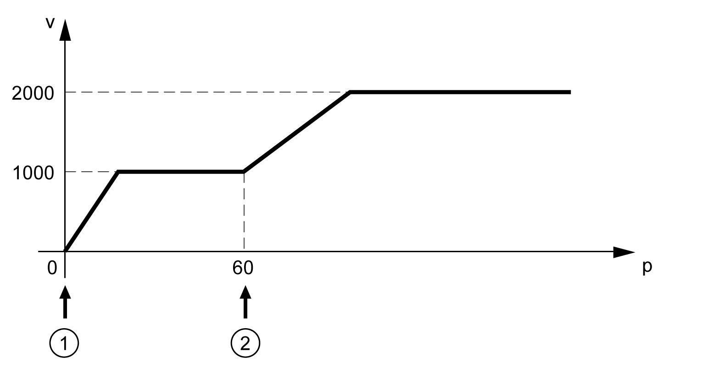

# Transitions Between Function Blocks

Transitions Between Function Blocks

This table presents how the execution of a function block (function block 1) can be terminated by another function block (function block 2).

|  |  |  |  |
| --- | --- | --- | --- |
|  | Function block 2 | | |
| Function block 1 | MC\_Jog\_LXM28 | MC\_Home\_LXM28 | MC\_MoveAbsolute\_LXM28 |
| MC\_Jog\_LXM28 | Immediately | Not permitted | Immediately |
| MC\_Home\_LXM28 | Not permitted | Not permitted | Not permitted |
| MC\_MoveAbsolute\_LXM28 | Immediately | Not permitted | Immediately |
| MC\_MoveAdditive\_LXM28 | Immediately | Not permitted | Immediately |
| MC\_MoveRelative\_LXM28 | Immediately | Not permitted | Immediately |
| MC\_MoveVelocity\_LXM28 | Immediately | Not permitted | Immediately |
| MC\_TorqueControl\_LXM28 | Immediately | Not permitted | Immediately |
| MC\_Stop\_LXM28 | Not permitted | Not permitted | Not permitted |
| MC\_Halt\_LXM28 | Not permitted | Not permitted | Not permitted |

|  |  |  |  |
| --- | --- | --- | --- |
|  | Function block 2 | | |
| Function block 1 | MC\_MoveAdditive\_LXM28 | MC\_MoveRelative\_LXM28 | MC\_MoveVelocity\_LXM28 |
| MC\_Jog\_LXM28 | Immediately | Immediately | Immediately |
| MC\_Home\_LXM28 | Not permitted | Not permitted | Not permitted |
| MC\_MoveAbsolute\_LXM28 | Immediately | Immediately | Immediately |
| MC\_MoveAdditive\_LXM28 | Immediately | Immediately | Immediately |
| MC\_MoveRelative\_LXM28 | Immediately | Immediately | Immediately |
| MC\_MoveVelocity\_LXM28 | Immediately | Immediately | Immediately |
| MC\_TorqueControl\_LXM28 | Immediately | Immediately | Immediately |
| MC\_Stop\_LXM28 | Not permitted | Not permitted | Not permitted |
| MC\_Halt\_LXM28 | Not permitted | Not permitted | Not permitted |

|  |  |  |  |
| --- | --- | --- | --- |
|  | Function block 2 | | |
| Function block 1 | MC\_TorqueControl\_LXM28 | MC\_Stop\_LXM28 | MC\_Halt\_LXM28 |
| MC\_Jog\_LXM28 | Immediately | Immediately | Immediately |
| MC\_Home\_LXM28 | Not permitted | Immediately | Not permitted |
| MC\_MoveAbsolute\_LXM28 | Immediately | Immediately | Immediately |
| MC\_MoveAdditive\_LXM28 | Immediately | Immediately | Immediately |
| MC\_MoveRelative\_LXM28 | Immediately | Immediately | Immediately |
| MC\_MoveVelocity\_LXM28 | Immediately | Immediately | Immediately |
| MC\_TorqueControl\_LXM28 | Immediately | Immediately | Immediately |
| MC\_Stop\_LXM28 | Not permitted | Not permitted | Not permitted |
| MC\_Halt\_LXM28 | Not permitted | Immediately | Immediately |

Immediately

The execution of function block 2 is started immediately; that is, the first function block is terminated and the second function block starts without delay. The execution of function block 1 is aborted.

|  |  |
| --- | --- |
| Function block 1 (MC\_MoveAbsolute\_LXM28) starts at position 0 | oPosition = 100  oVelocity = 1000 |
| Function block 2 (MC\_MoveVelocity\_LXM28) starts at position 60 | Velocity = 2000 |

Not Permitted

Function block 1 cannot be aborted by function block 2. Function block 2 will not be executed.

EIO0000002329.02

© 2019 Schneider Electric. All rights reserved.