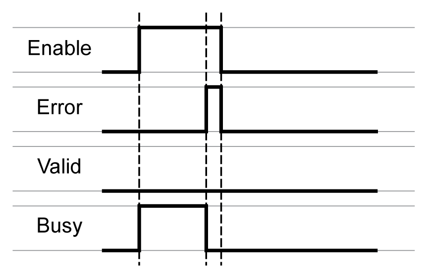
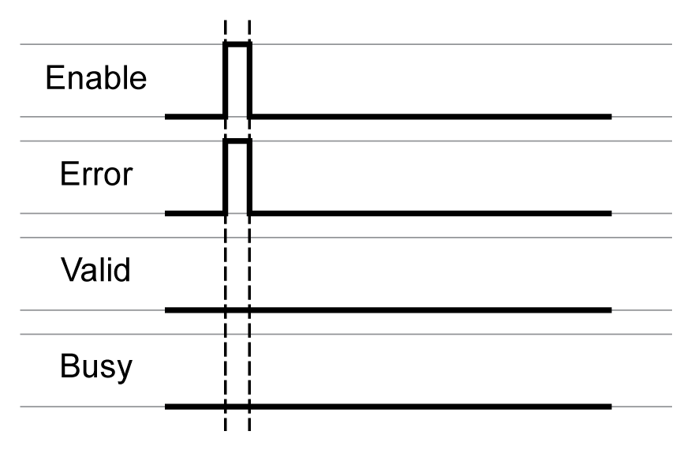
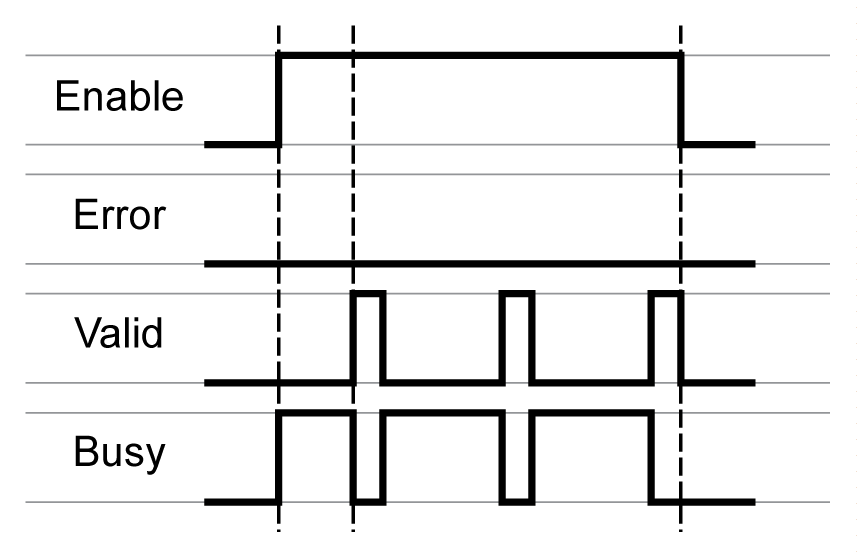
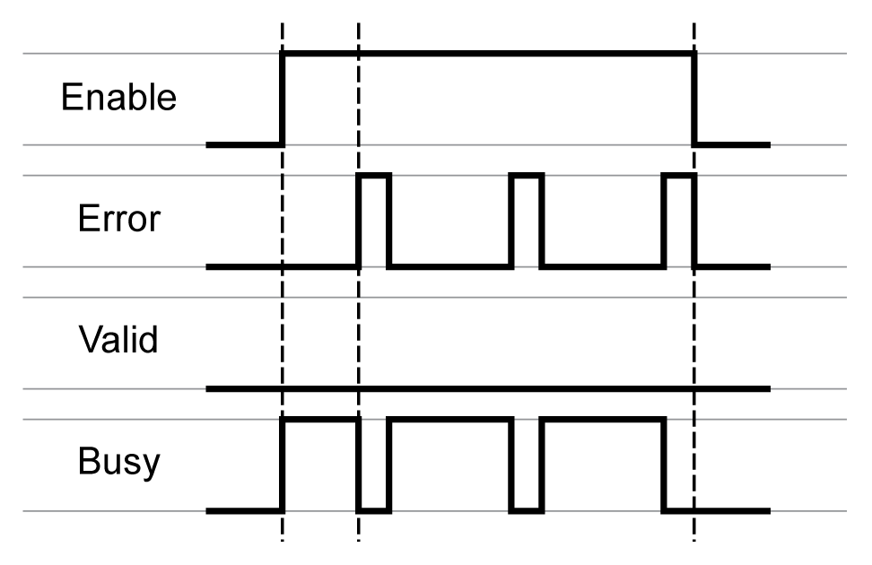
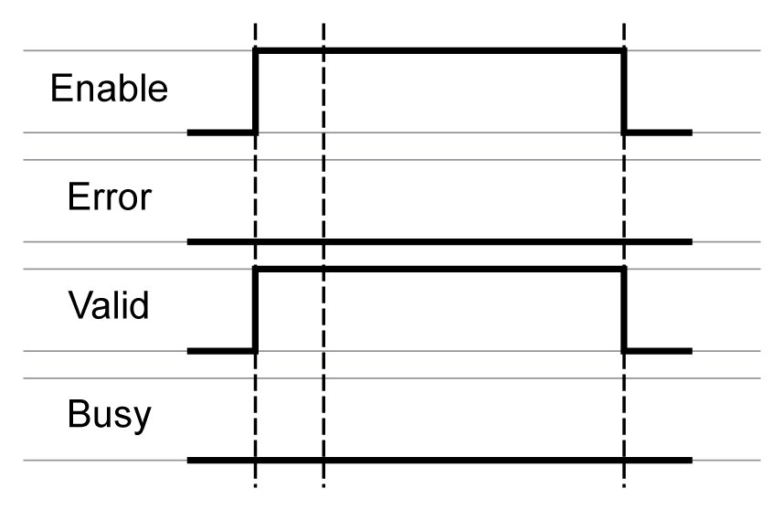
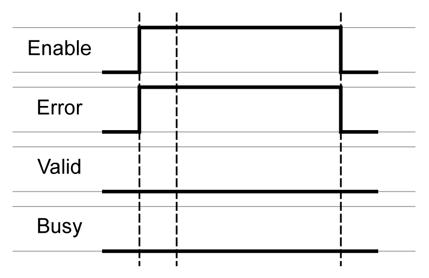

# Behavior of Function Blocks with the Input Enable

Behavior of Function Blocks with the Input Enable

Example 1

Single execution without an error detected (execution requires more than one call).

Example 2

Single execution with an error detected (execution requires more than one call).

Example 3

Single execution without an error detected (execution requires only one call).

Example 4

Single execution with an error detected (execution requires only one call).

Example 5

Repeated execution without an error detected (execution requires more than one call).

Example 6

Repeated execution with an error detected (execution requires more than one call).

Example 7

Repeated execution without an error detected (execution requires only one cycle).

Example 8

Repeated execution with an error detected (execution requires only one call).

EIO0000002329.02

© 2019 Schneider Electric. All rights reserved.