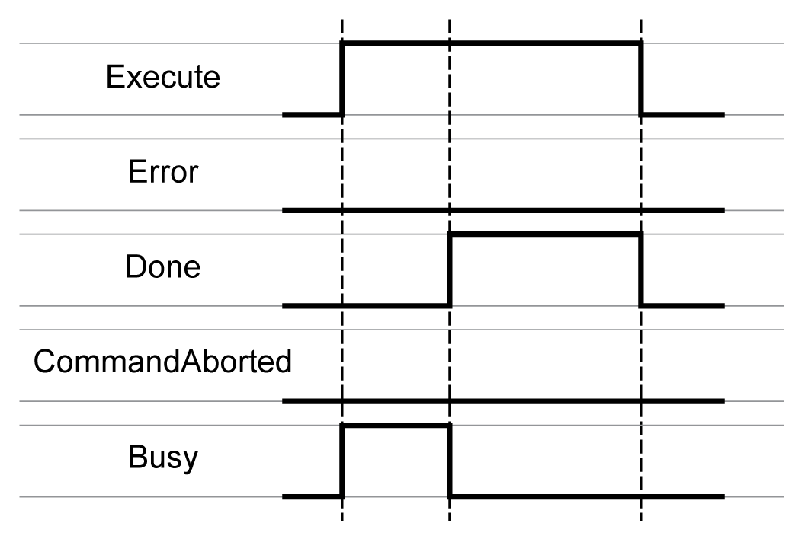

# Behavior of Function Blocks with the Input Execute

Behavior of Function Blocks with the Input Execute

Example 1

Execution terminated without an error detected.

Example 2

Execution terminated with an error detected.

Example 3

Execution aborted because another motion function block has been started.

Example 4

If the input Execute is set to FALSE during a cycle, the function block execution is not terminated; the output Done is set to TRUE only for one cycle.

EIO0000002329.02

© 2019 Schneider Electric. All rights reserved.