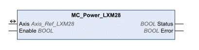

# Initialization

Initialization

MC\_Power\_LXM28

Functional Description

The function block enables or disables the power stage. TRUE at the input Enable enables the power stage. Once the power stage is enabled, the output Status is set. FALSE at the input Enable disables the power stage. Once the power stage is disabled, the output Status is reset. If errors are detected during execution, the output Error is set.

Library Name and Namespace

Library name: Lexium 28

Namespace: SEM\_LXM28

Graphical Representation

Inputs

| Input | Data Type | Description |
| --- | --- | --- |
| Enable | BOOL | Value range: FALSE, TRUE.  Default value: FALSE.  The input Enable starts or terminates execution of a function block.  oFALSE: Execution of the function block is terminated. The outputs Valid, Busy, and Error are set to FALSE.  oTRUE: The function block is being executed. The function block continues executing as long as the input Enable is set to TRUE. |

Outputs

| Output | Data Type | Description |
| --- | --- | --- |
| Status | BOOL | Value range: FALSE, TRUE.  Default value: FALSE.  oFALSE: Power stage is disabled.  oTRUE: Power stage is enabled. |
| Error | BOOL | Value range: FALSE, TRUE.  Default value: FALSE.  FALSE: Execution of the function block is running, no error has been detected.  TRUE: An error has been detected in the execution of the function block. |

Inputs/Outputs

| Input/Output | Data Type | Description |
| --- | --- | --- |
| Axis | Axis\_Ref\_LXM28 | Reference to the axis (instance) for which the function block is to be executed (corresponds to the name of the axis). The name of the axis must be defined in the SoMachine Devices tree. |

Notes

If a Node Guarding error or a Heartbeat error is detected, the error memory must be reset by means of the function block [MC\_Reset\_LXM28](../Function_Blocks_-_Administrative/Function_Blocks_-_Administrative-18.htm#XREF_D_SE_0059046_1) before the power stage can be enabled again.

Additional Information

[PLCopen State Diagram](../General_Description_of_the_LXM28_Library/General_Description_of_the_LXM28_Library-3.htm#XREF_D_SE_0059054_1)

[Initialization](#XREF_D_SE_0057537_1)

EIO0000002329.02

© 2019 Schneider Electric. All rights reserved.