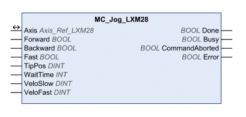

# Jog Operation

Jog Operation

MC\_Jog\_LXM28

Functional Description

The function block starts the Jog operation. TRUE at the input Forward or the input Backward starts the jog movement. If both the inputs Forward and Backward are FALSE, the Jog operation is terminated and the output Done is set. If both the inputs Forward and Backward are TRUE, the Jog operation remains active, but the jog movement is stopped and the output Busy remains set.

Library Name and Namespace

Library name: Lexium 28

Namespace: SEM\_LXM28

Graphical Representation

Inputs

| Input | Data Type | Description |
| --- | --- | --- |
| Forward | BOOL | Value range: FALSE, TRUE.  Default value: FALSE.  oFALSE: No movement in positive direction.  oTRUE: Movement in positive direction is started. |
| Backward | BOOL | Value range: FALSE, TRUE.  Default value: FALSE.  oFALSE: No movement in negative direction.  oTRUE: Movement in negative direction is started. |
| Fast | BOOL | Value range: FALSE, TRUE.  Default value: FALSE.  oFALSE: Movement at the velocity set in VeloSlow.  oTRUE: Movement at the velocity set in VeloFast. |
| TipPos | DINT | Value range: 0 ... 2147483647  Default value: 0  Position in the unit user-defined position.  o0: Continuous movement is started immediately.  o>0: Step movement is started. After the step movement has finished, the waiting time WaitTime starts. After the waiting time has elapsed, a continuous movement is started. |
| WaitTime | INT | Value range: 0 ... 65535  Default value: 500  Waiting time in the unit ms. If TipPos is >0, the waiting time WaitTime starts as soon as the adjusted distance has been covered. After the waiting time WaitTime has elapsed, a continuous movement is started. |
| VeloSlow | DINT | Value range: 0 ... 2147483647  Default value: 1280000  Velocity in the unit user-defined velocity.  If Fast = FALSE, the movement is made at this velocity. |
| VeloFast | DINT | Value range: 0 ... 2147483647  Default value: 6400000  Velocity in the unit user-defined velocity.  If Fast = TRUE, the movement is made at this velocity. |

Outputs

| Output | Data Type | Description |
| --- | --- | --- |
| Done | BOOL | Value range: FALSE, TRUE.  Default value: FALSE.  FALSE: Execution has not been started, or an error has been detected.  TRUE: Execution terminated without an error detected. |
| Busy | BOOL | Value range: FALSE, TRUE.  Default value: FALSE.  FALSE: Execution of the function block has not been started or not been terminated.  TRUE: Function block is being executed.  NOTE: The output Busy remains TRUE even when the target velocity has been reached or Execute becomes FALSE. The output Busy is set to FALSE as soon as another function block such as MC\_Stop is executed. |
| CommandAborted | BOOL | Value range: FALSE, TRUE.  Default value: FALSE.  FALSE: Execution has not been aborted.  TRUE: Execution has been aborted by another function block. |
| Error | BOOL | Value range: FALSE, TRUE.  Default value: FALSE.  FALSE: Execution of the function block is running, no error has been detected.  TRUE: An error has been detected in the execution of the function block. |

Inputs/Outputs

| Input/Output | Data Type | Description |
| --- | --- | --- |
| Axis | Axis\_Ref\_LXM28 | Reference to the axis (instance) for which the function block is to be executed (corresponds to the name of the axis). The name of the axis must be defined in the SoMachine Devices tree. |

Additional Information

[Transitions Between Function Blocks](../General_Description_of_the_LXM28_Library/General_Description_of_the_LXM28_Library-5.htm#XREF_D_SE_0059066_1)

[Jog Operation](#XREF_D_SE_0059078_1)

EIO0000002329.02

© 2019 Schneider Electric. All rights reserved.