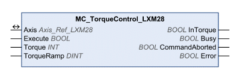

# Operating Mode Profile Torque

Operating Mode Profile Torque

MC\_TorqueControl\_LXM28

Functional Description

The function block starts the operating mode Profile Torque. In the operating mode Profile Torque, a movement is made with a desired target torque. The reference value for the target torque is supplied via the input Torque. When the target torque is reached, the output InTorque is set.

Library Name and Namespace

Library name: Lexium 28

Namespace: SEM\_LXM28

Graphical Representation

Inputs

| Input | Data Type | Description |
| --- | --- | --- |
| Execute | BOOL | Value range: FALSE, TRUE.  Default value: FALSE.  A rising edge of the input Execute starts the function block. The function block continues execution and the output Busy is set to TRUE. Function blocks which trigger a movement can be restarted while they are being executed. The target values are overwritten by the new values at the point in time the rising edge occurs. A rising edge at the input Execute is ignored while the function blocks are being executed.  oFALSE: If Enable is set to FALSE, the outputs Done, Error, or CommandAborted are set to TRUE for one cycle.  oTRUE: If Enable is set to FALSE, the outputs Done, Error, or CommandAborted remain set to TRUE. |
| Torque | INT | Value range: -32768 ... 32767  Default value: 0  Target torque  The value corresponds to 0.1 % of the nominal torque of the motor. Example: Torque = 300 corresponds to 30 % of the nominal torque of the motor. Use the object DS402 6076h to get the nominal torque of the motor.  See the product manual for an overview of the parameters. |
| TorqueRamp | DINT | Value range: 1 ... 30000000  Default value: 100000  The input TorqueRamp is used in the operating mode Profile Torque. The value corresponds to 0.1% per second of the nominal torque of the motor. Example: If TorqueRamp = 1000, then 100% of the nominal torque of the motor is reached in one second. Use the object DS402 6076h to get the nominal torque of the motor.  See the product manual for an overview of the parameters. |

Outputs

| Output | Data Type | Description |
| --- | --- | --- |
| InTorque | BOOL | Value range: FALSE, TRUE.  Default value: FALSE.  oFALSE: Target torque not yet reached.  oTRUE: Target torque reached. |
| Busy | BOOL | Value range: FALSE, TRUE.  Default value: FALSE.  FALSE: Execution of the function block has not been started or not been terminated.  TRUE: Function block is being executed.  NOTE: The output Busy remains TRUE even when the target velocity has been reached or Execute becomes FALSE. The output Busy is set to FALSE as soon as another function block such as MC\_Stop is executed. |
| CommandAborted | BOOL | Value range: FALSE, TRUE.  Default value: FALSE.  FALSE: Execution has not been aborted.  TRUE: Execution has been aborted by another function block. |
| Error | BOOL | Value range: FALSE, TRUE.  Default value: FALSE.  FALSE: Execution of the function block is running, no error has been detected.  TRUE: An error has been detected in the execution of the function block. |

Inputs/Outputs

| Input/Output | Data Type | Description |
| --- | --- | --- |
| Axis | Axis\_Ref\_LXM28 | Reference to the axis (instance) for which the function block is to be executed (corresponds to the name of the axis). The name of the axis must be defined in the SoMachine Devices tree. |

Notes

oIn order to use the torque ramp (input TorqueRamp) the Motion Profile for Torque must be activated (P5-15 = 1).

oThe output Busy remains TRUE even if the target torque has been reached or the input Execute is set to FALSE. The output Busy is set to FALSE as soon as another function block such as [MC\_Stop\_LXM28](Function_Blocks_-_Single_Axis-15.htm#XREF_D_SE_0059028_1) is executed.

oIn the operating mode Profile Torque, a movement beyond the movement range is possible. In the case of a movement beyond the movement range, the zero point becomes invalid.

Additional Information

[PLCopen State Diagram](../General_Description_of_the_LXM28_Library/General_Description_of_the_LXM28_Library-3.htm#XREF_D_SE_0059054_1)

[Transitions Between Function Blocks](../General_Description_of_the_LXM28_Library/General_Description_of_the_LXM28_Library-5.htm#XREF_D_SE_0059066_1)

[Operating Mode Profile Torque](#XREF_D_SE_0057539_1)

EIO0000002329.02

© 2019 Schneider Electric. All rights reserved.