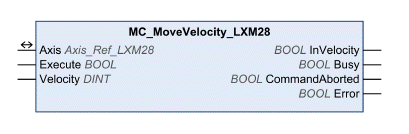

# Operating Mode Profile Velocity

Operating Mode Profile Velocity

MC\_MoveVelocity\_LXM28

Functional Description

The function block starts the operating mode Profile Velocity with the velocity Velocity. When the target velocity is reached, InVelocity is set.

The movement continues until a new target velocity is set or until the operating mode is aborted.

Transitions between two target velocities are performed on the basis of a motion profile. The motion profile is determined by the profile generator in the drive on the basis of the actual velocity, the target velocity and the acceleration and deceleration ramps.

Library Name and Namespace

Library name: Lexium 28

Namespace: SEM\_LXM28

Graphical Representation

Inputs

| Input | Data Type | Description |
| --- | --- | --- |
| Execute | BOOL | Value range: FALSE, TRUE.  Default value: FALSE.  A rising edge of the input Execute starts the function block. The function block continues execution and the output Busy is set to TRUE. Function blocks which trigger a movement can be restarted while they are being executed. The target values are overwritten by the new values at the point in time the rising edge occurs. A rising edge at the input Execute is ignored while the function blocks are being executed.  oFALSE: If Enable is set to FALSE, the outputs Done, Error, or CommandAborted are set to TRUE for one cycle.  oTRUE: If Enable is set to FALSE, the outputs Done, Error, or CommandAborted remain set to TRUE. |
| Velocity | DINT | Value range: -2147483648 ... 2147483647  Default value: 0  Target velocity in the unit user-defined velocity. |

Outputs

| Output | Data Type | Description |
| --- | --- | --- |
| InVelocity | BOOL | Value range: FALSE, TRUE.  Default value: FALSE.  oFALSE: Target velocity not yet reached.  oTRUE: Target velocity reached. |
| Busy | BOOL | Value range: FALSE, TRUE.  Default value: FALSE.  FALSE: Execution of the function block has not been started or not been terminated.  TRUE: Function block is being executed. |
| CommandAborted | BOOL | Value range: FALSE, TRUE.  Default value: FALSE.  FALSE: Execution has not been aborted.  TRUE: Execution has been aborted by another function block. |
| Error | BOOL | Value range: FALSE, TRUE.  Default value: FALSE.  FALSE: Execution of the function block is running, no error has been detected.  TRUE: An error has been detected in the execution of the function block. |

Inputs/Outputs

| Input/Output | Data Type | Description |
| --- | --- | --- |
| Axis | Axis\_Ref\_LXM28 | Reference to the axis (instance) for which the function block is to be executed (corresponds to the name of the axis). The name of the axis must be defined in the SoMachine Devices tree. |

Notes

oThe output Busy remains TRUE even if the target velocity has been reached or the input Execute is set to FALSE. The output Busy is set to FALSE as soon as another function block such as [MC\_Stop\_LXM28](Function_Blocks_-_Single_Axis-15.htm#XREF_D_SE_0059028_1) is executed.

oIn the operating mode Profile Velocity, a movement beyond the movement range is possible. In the case of a movement beyond the movement range, the zero point becomes invalid.

Additional Information

[PLCopen State Diagram](../General_Description_of_the_LXM28_Library/General_Description_of_the_LXM28_Library-3.htm#XREF_D_SE_0059054_1)

[Transitions Between Function Blocks](../General_Description_of_the_LXM28_Library/General_Description_of_the_LXM28_Library-5.htm#XREF_D_SE_0059066_1)

[Operating Mode Profile Velocity](#XREF_D_SE_0057540_1)

EIO0000002329.02

© 2019 Schneider Electric. All rights reserved.