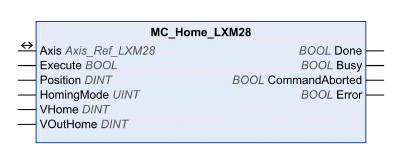

# MC_Home_LXM28

MC\_Home\_LXM28

Functional Description

The function block configures and starts a reference movement.

Reference movement: Movement to a limit switch, a reference switch or the index pulse of the motor encoder. When the position is reached, a position reference is automatically created. This position becomes the absolute user-defined position.

Library Name and Namespace

Library name: Lexium 28

Namespace: SEM\_LXM28

Graphical Representation

Inputs

| Input | Data Type | Description |
| --- | --- | --- |
| Execute | BOOL | Value range: FALSE, TRUE.  Default value: FALSE.  A rising edge of the input Execute starts the function block. The function block continues execution and the output Busy is set to TRUE. Function blocks which trigger a movement can be restarted while they are being executed. The target values are overwritten by the new values at the point in time the rising edge occurs. A rising edge at the input Execute is ignored while the function blocks are being executed.  oFALSE: If Enable is set to FALSE, the outputs Done, Error, or CommandAborted are set to TRUE for one cycle.  oTRUE: If Enable is set to FALSE, the outputs Done, Error, or CommandAborted remain set to TRUE. |
| Position | DINT | Value range: -2147483648 … 2147483647  Default value: 0  Position in the unit user-defined position.  For HomingMode 1 … 34: Position at reference point  For HomingMode 35: Position for Position Setting |
| HomingMode | UINT | Value range: 1 … 35  Default value: 1  For further information, refer to the [supported homing methods](Function_Blocks_-_Single_Axis-12.htm#XREF_D_SE_0069746_1).  NOTE: The limit switches must be assigned to the digital inputs for methods 1, 2, 7 … 14, 17, 18, and 23 … 30. |
| VHome | DINT | Value range: 1 … 2147483647  Default value: 1280000  Target velocity for searching the switch in the unit user-defined velocity.  For HomingMode 1 … 34 only. |
| VOutHome | DINT | Value range: 1 … 2147483647  Default value: 128000  Target velocity for moving away from switch in the unit user-defined velocity.  For HomingMode 1 … 34 only. |

Outputs

| Output | Data Type | Description |
| --- | --- | --- |
| Busy | BOOL | Value range: FALSE, TRUE.  Default value: FALSE.  FALSE: Execution of the function block has not been started or not been terminated.  TRUE: Function block is being executed. |
| CommandAborted | BOOL | Value range: FALSE, TRUE.  Default value: FALSE.  FALSE: Execution has not been aborted.  TRUE: Execution has been aborted by another function block. |
| Error | BOOL | Value range: FALSE, TRUE.  Default value: FALSE.  FALSE: Execution of the function block is running, no error has been detected.  TRUE: An error has been detected in the execution of the function block. |
| Done | BOOL | Value range: FALSE, TRUE.  Default value: FALSE.  FALSE: Execution has not been started, or an error has been detected.  TRUE: Execution terminated without an error detected. |

Inputs/Outputs

| Input/Output | Data Type | Description |
| --- | --- | --- |
| Axis | Axis\_Ref\_LXM28 | Reference to the axis (instance) for which the function block is to be executed (corresponds to the name of the axis). The name of the axis must be defined in the SoMachine Devices tree. |

Additional Information

[PLCopen State Diagram](../General_Description_of_the_LXM28_Library/General_Description_of_the_LXM28_Library-3.htm#XREF_D_SE_0059054_1)

[Transitions Between Function Blocks](../General_Description_of_the_LXM28_Library/General_Description_of_the_LXM28_Library-5.htm#XREF_D_SE_0059066_1)

[Operating Mode Homing](Function_Blocks_-_Single_Axis-10.htm#XREF_D_SE_0057542_1)

[Supported Homing Methods](Function_Blocks_-_Single_Axis-12.htm#XREF_D_SE_0069746_1)

EIO0000002329.02

© 2019 Schneider Electric. All rights reserved.