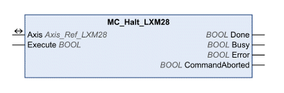

# MC_Halt_LXM28

MC\_Halt\_LXM28

Functional Description

The function block is used to stop the motor under normal operating conditions. The ongoing movement is canceled. The execution of the function block can be canceled by another function block with the prefix “MC\_”. If a Halt is triggered, there is a transition of the PLCopen state to “DiscreteMotion” until the motor has reached a standstill. Once the motor has reached a standstill, the output Done is set and the state transitions to “StandStill”.

Library Name and Namespace

Library name: Lexium 28

Namespace: SEM\_LXM28

Graphical Representation

Inputs

| Input | Data Type | Description |
| --- | --- | --- |
| Execute | BOOL | Value range: FALSE, TRUE.  Default value: FALSE.  A rising edge of the input Execute starts the function block. The function block continues execution and the output Busy is set to TRUE. Function blocks which trigger a movement can be restarted while they are being executed. The target values are overwritten by the new values at the point in time the rising edge occurs. A rising edge at the input Execute is ignored while the function blocks are being executed.  oFALSE: If Enable is set to FALSE, the outputs Done, Error, or CommandAborted are set to TRUE for one cycle.  oTRUE: If Enable is set to FALSE, the outputs Done, Error, or CommandAborted remain set to TRUE. |

Outputs

| Output | Data Type | Description |
| --- | --- | --- |
| Done | BOOL | Value range: FALSE, TRUE.  Default value: FALSE.  FALSE: Execution has not been started, or an error has been detected.  TRUE: Execution terminated without an error detected. |
| Busy | BOOL | Value range: FALSE, TRUE.  Default value: FALSE.  FALSE: Execution of the function block has not been started or not been terminated.  TRUE: Function block is being executed. |
| Error | BOOL | Value range: FALSE, TRUE.  Default value: FALSE.  FALSE: Execution of the function block is running, no error has been detected.  TRUE: An error has been detected in the execution of the function block. |
| CommandAborted | BOOL | Value range: FALSE, TRUE.  Default value: FALSE.  FALSE: Execution has not been aborted.  TRUE: Execution has been aborted by another function block. |

Inputs/Outputs

| Input/Output | Data Type | Description |
| --- | --- | --- |
| Axis | Axis\_Ref\_LXM28 | Reference to the axis (instance) for which the function block is to be executed (corresponds to the name of the axis). The name of the axis must be defined in the SoMachine Devices tree. |

Additional Information

[PLCopen State Diagram](../General_Description_of_the_LXM28_Library/General_Description_of_the_LXM28_Library-3.htm#XREF_D_SE_0059054_1)

[Transitions Between Function Blocks](../General_Description_of_the_LXM28_Library/General_Description_of_the_LXM28_Library-5.htm#XREF_D_SE_0059066_1)

[Stopping](Function_Blocks_-_Single_Axis-14.htm#XREF_D_SE_0057543_1)

EIO0000002329.02

© 2019 Schneider Electric. All rights reserved.