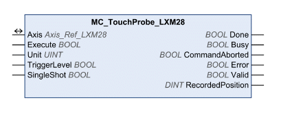

# MC_TouchProbe_LXM28

MC\_TouchProbe\_LXM28

Functional Description

The function block configures and starts position capture.

Position capture via a signal input captures the position at the point in time at which an edge is detected at one of the digital Capture inputs.

Position capture can be triggered by a rising edge or a falling edge at the signal input.

Library Name and Namespace

Library name: Lexium 28

Namespace: SEM\_LXM28

Graphical Representation

Inputs

| Input | Data Type | Description |
| --- | --- | --- |
| Execute | BOOL | Value range: FALSE, TRUE.  Default value: FALSE.  A rising edge of the input Execute starts the function block. The function block continues execution and the output Busy is set to TRUE. Function blocks which trigger a movement can be restarted while they are being executed. The target values are overwritten by the new values at the point in time the rising edge occurs. A rising edge at the input Execute is ignored while the function blocks are being executed.  oFALSE: If Enable is set to FALSE, the outputs Done, Error, or CommandAborted are set to TRUE for one cycle.  oTRUE: If Enable is set to FALSE, the outputs Done, Error, or CommandAborted remain set to TRUE. |
| Unit | UINT | Value range: 1 ... 2  Default value: 1  o1: Capture input 1  o2: Capture input 2 |
| TriggerLevel | BOOL | Value range: FALSE, TRUE.  Default value: FALSE.  oFALSE: Start position capture at falling edge.  oTRUE: Start position capture at rising edge. |
| SingleShot | BOOL | Value range: FALSE, TRUE.  Default value: FALSE.  oFALSE: Set continuous position capture. Continuous capture means that the motor position is captured anew at every edge. The previously captured value is overwritten.  oTRUE: Sets one-time position capture. One-time capture means that the position is captured at the first edge. The capture value is not overwritten by a new edge. |

Outputs

| Output | Data Type | Description |
| --- | --- | --- |
| Done | BOOL | Value range: FALSE, TRUE.  Default value: FALSE.  FALSE: Execution has not been started, or an error has been detected.  TRUE: Execution terminated without an error detected. |
| Busy | BOOL | Value range: FALSE, TRUE.  Default value: FALSE.  FALSE: Execution of the function block has not been started or not been terminated.  TRUE: Function block is being executed. |
| CommandAborted | BOOL | Value range: FALSE, TRUE.  Default value: FALSE.  FALSE: Execution has not been aborted.  TRUE: Execution has been aborted by another function block. |
| Error | BOOL | Value range: FALSE, TRUE.  Default value: FALSE.  FALSE: Execution of the function block is running, no error has been detected.  TRUE: An error has been detected in the execution of the function block. |
| Valid | BOOL | Value range: FALSE, TRUE.  Default value: FALSE.  FALSE: Execution has not been started or an error has been detected. The values at the outputs are not valid.  TRUE: Execution has been completed without an error detected. The values at the outputs are valid and can be further processed. |
| RecordedPosition | DINT | Value range: -2147483648 ... 2147483647  Default value: 0  Captured motor position in the unit user-defined position |

Inputs/Outputs

| Input/Output | Data Type | Description |
| --- | --- | --- |
| Axis | Axis\_Ref\_LXM28 | Reference to the axis (instance) for which the function block is to be executed (corresponds to the name of the axis). The name of the axis must be defined in the SoMachine Devices tree. |

Notes

If you want to use both capture inputs simultaneously use a separate function block instance for each capture input.

Additional Information

[Position Capture through Signal Input](Function_Blocks_-_Single_Axis-17.htm#XREF_D_SE_0057544_1)

EIO0000002329.02

© 2019 Schneider Electric. All rights reserved.