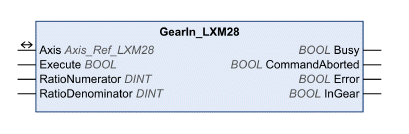

# GearIn_LXM28

GearIn\_LXM28

Functional Description

The function block starts the operating mode Electronic Gear. In the operating mode Electronic Gear, movements are carried out according to externally supplied reference value signals. The movement is made synchronously (velocity synchronicity) with the supplied reference value signals and calculated on the basis of an adjustable gear ratio.

Library Name and Namespace

Library name: Lexium 28

Namespace: SEM\_LXM28

Graphical Representation

Inputs

| Input | Data Type | Description |
| --- | --- | --- |
| Execute | BOOL | Value range: FALSE, TRUE.  Default value: FALSE.  A rising edge of the input Execute starts the function block. The function block continues execution and the output Busy is set to TRUE. Function blocks which trigger a movement can be restarted while they are being executed. The target values are overwritten by the new values at the point in time the rising edge occurs. A rising edge at the input Execute is ignored while the function blocks are being executed.  oFALSE: If Enable is set to FALSE, the outputs Done, Error, or CommandAborted are set to TRUE for one cycle.  oTRUE: If Enable is set to FALSE, the outputs Done, Error, or CommandAborted remain set to TRUE. |
| RatioNumerator | DINT | Value range: 1 ... 2147483647  Default value: 1  Gear ratio: Numerator of gear ratio |
| RatioDenominator | DINT | Value range: 1 ... 32767  Default value: 1  Gear ratio: Denominator of gear ratio |

Outputs

| Output | Data Type | Description |
| --- | --- | --- |
| Busy | BOOL | Value range: FALSE, TRUE.  Default value: FALSE.  FALSE: Execution of the function block has not been started or not been terminated.  TRUE: Function block is being executed. |
| CommandAborted | BOOL | Value range: FALSE, TRUE.  Default value: FALSE.  FALSE: Execution has not been aborted.  TRUE: Execution has been aborted by another function block. |
| Error | BOOL | Value range: FALSE, TRUE.  Default value: FALSE.  FALSE: Execution of the function block is running, no error has been detected.  TRUE: An error has been detected in the execution of the function block. |
| InGear | BOOL | Value range: FALSE, TRUE.  Default value: FALSE.  The output is set to TRUE if the adjusted gear ratio is reached for the first time. |

Inputs/Outputs

| Input/Output | Data Type | Description |
| --- | --- | --- |
| Axis | Axis\_Ref\_LXM28 | Reference to the axis (instance) for which the function block is to be executed (corresponds to the name of the axis). The name of the axis must be defined in the SoMachine Devices tree. |

Notes

The reference value signals can be A/B signals, P/D signals or CW/CCW signals. See parameter P1-00 for details.

Reference value signals supplied during an interruption caused by Halt or by a detected error are not taken into account.

Additional Information

[PLCopen State Diagram](../General_Description_of_the_LXM28_Library/General_Description_of_the_LXM28_Library-3.htm#XREF_D_SE_0059054_1)

[Operating Mode Electronic Gear](Function_Blocks_-_Multi_Axis-1.htm#XREF_D_SE_0057545_1)

EIO0000002329.02

© 2019 Schneider Electric. All rights reserved.