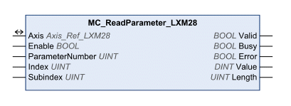

# MC_ReadParameter_LXM28

MC\_ReadParameter\_LXM28

Functional Description

The function block reads an object from the device parameter list.

Library Name and Namespace

Library name: Lexium 28

Namespace: SEM\_LXM28

Graphical Representation

Inputs

| Input | Data Type | Description |
| --- | --- | --- |
| Enable | BOOL | Value range: FALSE, TRUE.  Default value: FALSE.  The input Enable starts or terminates execution of a function block.  oFALSE: Execution of the function block is terminated. The outputs Valid, Busy, and Error are set to FALSE.  oTRUE: The function block is being executed. The function block continues executing as long as the input Enable is set to TRUE. |
| ParameterNumber | UINT | Value range: 0 ... 65535  Default value: 1000  Number of the parameter:  o1: Reference position (from profile generator).  o2: Positive position limit of software limit switch.  o3: Negative position limit of software limit switch.  o10: Actual velocity.  o11: Target velocity.  o1000: Selection via index and subindex.  o1001: Monitoring of the positive and negative software limit switch (Deactivated: Bit 0 = 0. Activated: Bit 0 = 1).  See the product manual for an overview of the parameters. |
| Index | UINT | Value range: 0 ... 65535  Default value: 0  Index of parameter to be read. Only valid if ParameterNumber = 1000.  See the product manual for an overview of the parameters. |
| Subindex | UINT | Value range: 0 ... 255  Default value: 0  Subindex of parameter to be read. Only valid if ParameterNumber = 1000.  See the product manual for an overview of the parameters. |

Outputs

| Output | Data Type | Description |
| --- | --- | --- |
| Valid | BOOL | Value range: FALSE, TRUE.  Default value: FALSE.  FALSE: Execution has not been started or an error has been detected. The values at the outputs are not valid.  TRUE: Execution has been completed without an error detected. The values at the outputs are valid and can be further processed. |
| Busy | BOOL | Value range: FALSE, TRUE.  Default value: FALSE.  FALSE: Execution of the function block has not been started or not been terminated.  TRUE: Function block is being executed. |
| Error | BOOL | Value range: FALSE, TRUE.  Default value: FALSE.  FALSE: Execution of the function block is running, no error has been detected.  TRUE: An error has been detected in the execution of the function block. |
| Value | DINT | Value range: -2147483648 ... 2147483647  Default value: 0  Value of the parameter. |
| Length | UINT | Value range: 1 ... 4  Default value: 0  Length of the parameter in bytes. |

Inputs/Outputs

| Input/Output | Data Type | Description |
| --- | --- | --- |
| Axis | Axis\_Ref\_LXM28 | Reference to the axis (instance) for which the function block is to be executed (corresponds to the name of the axis). The name of the axis must be defined in the SoMachine Devices tree. |

Notes

The read value will be interpreted as a DINT value. If you want to read a parameter with the data type UDINT you need to convert the read value with the function DINT\_TO\_UDINT().

Additional Information

[Reading a Parameter](Function_Blocks_-_Administrative-2.htm#XREF_D_SE_0057547_1)

EIO0000002329.02

© 2019 Schneider Electric. All rights reserved.