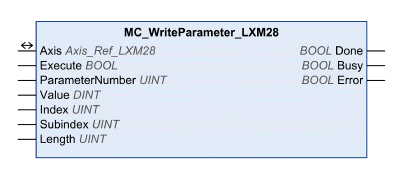

# Writing a Parameter

Writing a Parameter

MC\_WriteParameter\_LXM28

Functional Description

The function block is used to write a value to a specific parameter.

Library Name and Namespace

Library name: Lexium 28

Namespace: SEM\_LXM28

Graphical Representation

Inputs

| Input | Data Type | Description |
| --- | --- | --- |
| Execute | BOOL | Value range: FALSE, TRUE.  Default value: FALSE.  A rising edge of the input Execute starts the function block. The function block continues execution and the output Busy is set to TRUE. Function blocks which trigger a movement can be restarted while they are being executed. The target values are overwritten by the new values at the point in time the rising edge occurs. A rising edge at the input Execute is ignored while the function blocks are being executed.  oFALSE: If Enable is set to FALSE, the outputs Done, Error, or CommandAborted are set to TRUE for one cycle.  oTRUE: If Enable is set to FALSE, the outputs Done, Error, or CommandAborted remain set to TRUE. |
| ParameterNumber | UINT | Value range: 0 ... 65535  Default value: 1000  o2: Position of the software limit switch in positive direction.  o3: Position of the software limit switch in negative direction.  o1000: The parameter to be written is set via the inputs Index and SubIndex.  o1001: Activate (Value Bit 0 = 1) or deactivate (Value Bit 0 = 0) software limit switch in positive and negative direction.  See the product manual for a list of the parameters with the corresponding CANopen address. |
| Value | DINT | Value range: -2147483648 ... 2147483647  Default value: 0  New value to be written to the parameter. The units of the values depend on the parameter. |
| Index | UINT | Value range: 0 ... 65535  Default value: 0  Index of the parameter to be written. See the product manual for a list of the parameters with index and subindex. Can only be used if the input ParameterNumber = 1000.  See the product manual for a list of the parameters with the corresponding CANopen address. |
| Subindex | UINT | Value range: 0 ... 255  Default value: 0  Subindex of the parameter to be written. See the product manual for a list of the parameters with index and subindex. Can only be used if the input ParameterNumber = 1000.  See the product manual for a list of the parameters with the corresponding CANopen address. |
| Length | UINT | Value range: 1 ... 4  Default value: 0  Length of the parameter to be written in bytes. |

Outputs

| Output | Data Type | Description |
| --- | --- | --- |
| Done | BOOL | Value range: FALSE, TRUE.  Default value: FALSE.  FALSE: Execution has not been started, or an error has been detected.  TRUE: Execution terminated without an error detected. |
| Busy | BOOL | Value range: FALSE, TRUE.  Default value: FALSE.  FALSE: Execution of the function block has not been started or not been terminated.  TRUE: Function block is being executed. |
| Error | BOOL | Value range: FALSE, TRUE.  Default value: FALSE.  FALSE: Execution of the function block is running, no error has been detected.  TRUE: An error has been detected in the execution of the function block. |

Inputs/Outputs

| Input/Output | Data Type | Description |
| --- | --- | --- |
| Axis | Axis\_Ref\_LXM28 | Reference to the axis (instance) for which the function block is to be executed (corresponds to the name of the axis). The name of the axis must be defined in the SoMachine Devices tree. |

Notes

If the inputs ParameterNumber, Index or Subindex are modified while Busy is TRUE, the new values are not used until the function block is executed again.

Additional Information

[Writing a Parameter](#XREF_D_SE_0057548_1)

EIO0000002329.02

© 2019 Schneider Electric. All rights reserved.