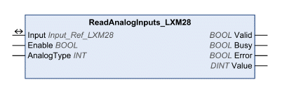

# ReadAnalogInputs_LXM28

ReadAnalogInputs\_LXM28

Functional Description

The function block reads the values of the analog inputs.

Library Name and Namespace

Library name: Lexium 28

Namespace: SEM\_LXM28

Graphical Representation

Inputs

| Input | Data Type | Description |
| --- | --- | --- |
| Enable | BOOL | Value range: FALSE, TRUE.  Default value: FALSE.  The input Enable starts or terminates execution of a function block.  oFALSE: Execution of the function block is terminated. The outputs Valid, Busy, and Error are set to FALSE.  oTRUE: The function block is being executed. The function block continues executing as long as the input Enable is set to TRUE. |
| AnalogType | INT | Value range: 1 ... 2  Default value: 1  Selection of analog input  o1: Analog input for reference torque  o2: Analog input for reference velocity |

Outputs

| Output | Data Type | Description |
| --- | --- | --- |
| Valid | BOOL | Value range: FALSE, TRUE.  Default value: FALSE.  FALSE: Execution has not been started or an error has been detected. The values at the outputs are not valid.  TRUE: Execution has been completed without an error detected. The values at the outputs are valid and can be further processed. |
| Busy | BOOL | Value range: FALSE, TRUE.  Default value: FALSE.  FALSE: Execution of the function block has not been started or not been terminated.  TRUE: Function block is being executed. |
| Error | BOOL | Value range: FALSE, TRUE.  Default value: FALSE.  FALSE: Execution of the function block is running, no error has been detected.  TRUE: An error has been detected in the execution of the function block. |
| Value | DINT | Value range: -10000 ... 10000  Default value: 0  Corresponds to the input voltage in mV at the analog input. |

Inputs/Outputs

| Input/Output | Data Type | Description |
| --- | --- | --- |
| Input | Input\_Ref\_LXM28 | Input is a special data type for digital and analog inputs (if available). The data type corresponds to the axis reference from the device configuration (instance) to which the inputs belong (similar to Axis). In the case of function blocks provided for reading analog and digital inputs, Input replaces the input Axis. |

Additional Information

[Inputs and Outputs](Function_Blocks_-_Administrative-11.htm#XREF_D_SE_0057549_1)

EIO0000002329.02

© 2019 Schneider Electric. All rights reserved.