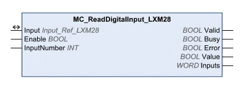

# MC_ReadDigitalInput_LXM28

MC\_ReadDigitalInput\_LXM28

Functional Description

The function block is used to read the state of the digital inputs of the drive.

Library Name and Namespace

Library name: Lexium 28

Namespace: SEM\_LXM28

Graphical Representation

Inputs

| Input | Data Type | Description |
| --- | --- | --- |
| Enable | BOOL | Value range: FALSE, TRUE.  Default value: FALSE.  The input Enable starts or terminates execution of a function block.  oFALSE: Execution of the function block is terminated. The outputs Valid, Busy, and Error are set to FALSE.  oTRUE: The function block is being executed. The function block continues executing as long as the input Enable is set to TRUE. |
| InputNumber | INT | Value range: 1 ... 8  Default value: 1  Number of the input to be read.  o1: DI1  o2: DI2  o3: DI3  o4: DI4  o5: DI5  o6: DI6  o7: DI7  o8: DI8 |

Outputs

| Output | Data Type | Description |
| --- | --- | --- |
| Valid | BOOL | Value range: FALSE, TRUE.  Default value: FALSE.  FALSE: Execution has not been started or an error has been detected. The values at the outputs are not valid.  TRUE: Execution has been completed without an error detected. The values at the outputs are valid and can be further processed. |
| Busy | BOOL | Value range: FALSE, TRUE.  Default value: FALSE.  FALSE: Execution of the function block has not been started or not been terminated.  TRUE: Function block is being executed. |
| Error | BOOL | Value range: FALSE, TRUE.  Default value: FALSE.  FALSE: Execution of the function block is running, no error has been detected.  TRUE: An error has been detected in the execution of the function block. |
| Value | BOOL | Value range: FALSE, TRUE.  Default value: FALSE.  oFALSE: Level at selected input is 0 V.  oTRUE: Level at selected input is 24 V. |
| Inputs | WORD | Value range: 00 ... FFh  Default value: 00h  Image of the inputs as a bit pattern. Bit 0 = first input.  oBit 0: DI1  oBit 1: DI2  oBit 2: DI3  oBit 3: DI4  oBit 4: DI5  oBit 5: DI6  oBit 6: DI7  oBit 7: DI8 |

Inputs/Outputs

| Input/Output | Data Type | Description |
| --- | --- | --- |
| Input | Input\_Ref\_LXM28 | Input is a special data type for digital and analog inputs (if available). The data type corresponds to the axis reference from the device configuration (instance) to which the inputs belong (similar to Axis). In the case of function blocks provided for reading analog and digital inputs, Input replaces the input Axis. |

Notes

See the product manual for a description of the digital inputs.

Additional Information

[Inputs and Outputs](Function_Blocks_-_Administrative-11.htm#XREF_D_SE_0057549_1)

EIO0000002329.02

© 2019 Schneider Electric. All rights reserved.