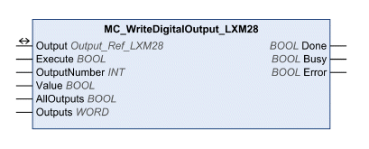

# MC_WriteDigitalOutput_LXM28

MC\_WriteDigitalOutput\_LXM28

Functional Description

The function blocks writes values to the digital outputs.

Library Name and Namespace

Library name: Lexium 28

Namespace: SEM\_LXM28

Graphical Representation

Inputs

| Input | Data Type | Description |
| --- | --- | --- |
| Execute | BOOL | Value range: FALSE, TRUE.  Default value: FALSE.  A rising edge of the input Execute starts the function block. The function block continues execution and the output Busy is set to TRUE. Function blocks which trigger a movement can be restarted while they are being executed. The target values are overwritten by the new values at the point in time the rising edge occurs. A rising edge at the input Execute is ignored while the function blocks are being executed.  oFALSE: If Enable is set to FALSE, the outputs Done, Error, or CommandAborted are set to TRUE for one cycle.  oTRUE: If Enable is set to FALSE, the outputs Done, Error, or CommandAborted remain set to TRUE. |
| OutputNumber | INT | Value range: 1 ... 5  Default value: 1  Signal output to which to write.  o1: DO1  o2: DO2  o3: DO3  o4: DO4  o5: DO5  Output DO6 cannot be written. |
| Value | BOOL | Value range: FALSE, TRUE.  Default value: FALSE.  oFALSE: 0V is written to the selected signal output.  oTRUE: 24V is written to the selected signal output. |
| AllOutputs | BOOL | Value range: FALSE, TRUE.  Default value: FALSE.  oFALSE: The signal output to be written to is set via input OutputNumber.  oTRUE: The signal outputs are written according to the bit pattern set via the input Outputs. |
| Outputs | WORD | Value range: 00 ... 1Fh  Default value: 00h  Image of the outputs as a bit pattern. Bit 0 = first output.  oBit 0: DO1  oBit 1: DO2  oBit 2: DO3  oBit 3: DO4  oBit 4: DO5  Output DO6 cannot be written. |

Outputs

| Output | Data Type | Description |
| --- | --- | --- |
| Done | BOOL | Value range: FALSE, TRUE.  Default value: FALSE.  FALSE: Execution has not been started, or an error has been detected.  TRUE: Execution terminated without an error detected. |
| Busy | BOOL | Value range: FALSE, TRUE.  Default value: FALSE.  FALSE: Execution of the function block has not been started or not been terminated.  TRUE: Function block is being executed. |
| Error | BOOL | Value range: FALSE, TRUE.  Default value: FALSE.  FALSE: Execution of the function block is running, no error has been detected.  TRUE: An error has been detected in the execution of the function block. |

Inputs/Outputs

| Input/Output | Data Type | Description |
| --- | --- | --- |
| Output | Output\_Ref\_LXM28 | Output is a special data type for digital and analog outputs (if available). The data type corresponds to the axis reference from the device configuration (instance) to which the outputs belong (similar to Axis). In the case of function blocks provided for writing and reading digital inputs, Output replaces the output Axis. |

Notes

You can set via parameter P4-27 which digital signal output can be written. If you want to write several outputs simultaneously (AllOutputs = True) you have to release all outputs (P4-27 = 1Fh).

See the product manual for a description of the digital outputs.

Additional Information

[Inputs and Outputs](Function_Blocks_-_Administrative-11.htm#XREF_D_SE_0057549_1)

EIO0000002329.02

© 2019 Schneider Electric. All rights reserved.