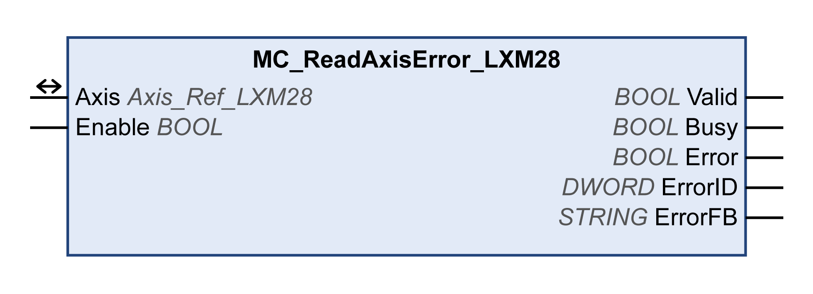

# MC_ReadAxisError_LXM28

MC\_ReadAxisError\_LXM28

Functional Description

The function block reads the error information pertaining to the most recent detected error.

Library Name and Namespace

Library name: Lexium 28

Namespace: SEM\_LXM28

Graphical Representation

Inputs

| Input | Data Type | Description |
| --- | --- | --- |
| Enable | BOOL | Value range: FALSE, TRUE.  Default value: FALSE.  The input Enable starts or terminates execution of a function block.  oFALSE: Execution of the function block is terminated. The outputs Valid, Busy, and Error are set to FALSE.  oTRUE: The function block is being executed. The function block continues executing as long as the input Enable is set to TRUE. |

Outputs

| Output | Data Type | Description |
| --- | --- | --- |
| Valid | BOOL | Value range: FALSE, TRUE.  Default value: FALSE.  FALSE: Execution has not been started or an error has been detected. The values at the outputs are not valid.  TRUE: Execution has been completed without an error detected. The values at the outputs are valid and can be further processed. |
| Busy | BOOL | Value range: FALSE, TRUE.  Default value: FALSE.  FALSE: Execution of the function block has not been started or not been terminated.  TRUE: Function block is being executed. |
| Error | BOOL | Value range: FALSE, TRUE.  Default value: FALSE.  FALSE: Execution of the function block is running, no error has been detected.  TRUE: An error has been detected in the execution of the function block. |
| ErrorID | DWORD | Value range: 0000 ... FFFFh  Default value: 0000h  o0: No detected error stored.  o>0: Number of stored detected error.  See the table [Library Diagnostic Codes](../General_Description_of_the_LXM28_Library/General_Description_of_the_LXM28_Library-6.htm#XREF_D_SE_0059136_1) for an overview of the error numbers of the library.  See the product manual for an overview of the error numbers of the drive. |
| ErrorFB | STRING | Corresponds to the instance name of the function block that has caused the detected error. |

Inputs/Outputs

| Input/Output | Data Type | Description |
| --- | --- | --- |
| Axis | Axis\_Ref\_LXM28 | Reference to the axis (instance) for which the function block is to be executed (corresponds to the name of the axis). The name of the axis must be defined in the SoMachine Devices tree. |

Additional Information

[Library Diagnostic Codes](../General_Description_of_the_LXM28_Library/General_Description_of_the_LXM28_Library-6.htm#XREF_D_SE_0059136_1)

[Error Handling](Function_Blocks_-_Administrative-16.htm#XREF_D_SE_0057550_1)

EIO0000002329.02

© 2019 Schneider Electric. All rights reserved.