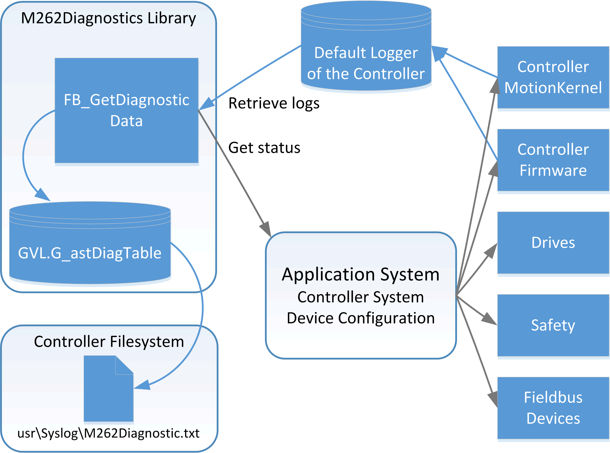

# Presentation of the Library

Presentation of the Library

General Information

Library Overview

The M262Diagnostics library is used to gather system information about an Modicon M262 Logic/Motion Controller application and its configured devices.

Characteristics of the Library

The following table indicates the characteristics of the library:

| Characteristic | Value |
| --- | --- |
| Library title | M262Diagnostics |
| Company | Schneider Electric |
| Category | Application |
| Component | Core Libraries |
| Default namespace | M262Diag |
| Language model attribute | [Qualified-access-only](../../../../../../api/crossBook?lang=en-US&virtualBookName=SoLibref&topicID=D_SE_0081219_10) |
| Forward compatible library | Yes ([FCL](../glossary/glossary.htm#XREF_D_SE_0024697_760)) |

NOTE: For this library, qualified-access-only is set. This means that the [POUs](../glossary/glossary.htm#XREF_D_SE_0024697_158), data structures, enumerations, and constants have to be accessed using the namespace of the library. The default namespace of the library is M262Diag.

General Considerations

The M262Diagnostics library is only supported by the Modicon M262 Logic/Motion Controller.

EIO0000003927.01

© 2019 Schneider Electric. All rights reserved.