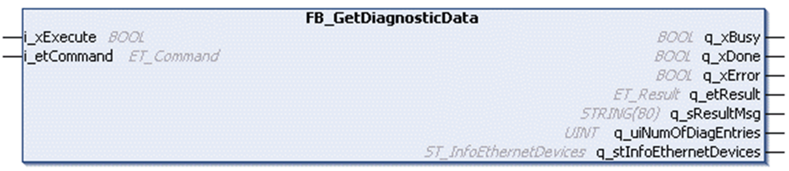

# FB_GetDiagnosticData - Functional Description

FB\_GetDiagnosticData - Functional Description

Overview

|  |  |
| --- | --- |
| Type: | Function block |
| Available as of: | V1.0.0.0 |

Functional Description

The FB\_GetDiagnosticData function block is used to provide dedicated system diagnostics of an M262 application.

The following functions are supported:

oRetrieving the logger messages sent by the controller [MotionKernel](../glossary/glossary.htm#XREF_D_SE_0097798_4) component to the default logger of the controller.

oRetrieving the diagnostic information provided by the controller.

oCreating a file with the retrieved diagnostic messages.

oClearing the data table.

Only one instance of the function block is allowed in an application. If more than one instance exist, the later initialized instances indicate the result AnotherInstanceOfFbExistsInApp at q\_etResult.

Retrieving Logger Messages from the MotionKernel

As soon as the function block is instantiated in the application, retrieving the logger messages from the [MotionKernel](../glossary/glossary.htm#XREF_D_SE_0097798_4) is in progress. Each message which is sent to the default logger of the controller by the MotionKernel component is detected and stored in the data table GVL.G\_astDiagTable. The source of these messages is specified as MotionKernel.

The logger messages from the MotionKernel are retrieved and stored in the GVL.G\_astDiagTable, even if the function block is not called in the application.

Retrieving Diagnostic Information from the Controller System

Executing the function block with the command GetDiagData is starting a system diagnostic of the controller. The gathered diagnostic messages are stored in the data table GVL.G\_astDiagTable. The source of these messages is specified as FbGetDiag. On each execution, existing diagnostic messages with source FbGetDiag are removed from the data table. The time stamp of the new diagnostic messages is set to the date when the function block is executed.

Creating the Diagnostic Messages File on the Controller

Executing the function block with the command CreateFileFromDiagTable is used to create a file on the controllers file system.

The path of the file created on the controller is usr/Syslog/M262Diagnostic.txt.

The file contains the diagnostic messages from the data table GVL.G\_astDiagTable. The columns are separated by commas.

Data Table

The diagnostic messages are written to the data table GVL.G\_astDiagTable, which can be accessed by the application for further analysis.

The most recent message is provided in the lowest index of the array.

If the array is full, for each new message the oldest one is removed (ring buffer).

Interface

| Input | Data type | Description |
| --- | --- | --- |
| i\_xExecute | BOOL | Upon a rising edge, the specified command is executed by the function block. |
| i\_etCommand | STRING(255) | Specifies the command to be executed. |
| i\_stParamters | ST\_ParamFbGetDiag | Parameters for the execution of the function block. |

The elements of ST\_ParamFbGetDiag are initialized as follows:

otimTimeoutGetDiagData := T#10S, lower limit for the value is T#1s

otimTimeoutCreateFile := T#10S, lower limit for the value is T#1s

obyPlcDiagOptEthItfToCheck := 2#11

| Output | Data type | Description |
| --- | --- | --- |
| q\_xDone | BOOL | If this output is set to TRUE, the execution has been completed successfully. |
| q\_xBusy | BOOL | If this output is set to TRUE, the function block execution is in progress. |
| q\_xError | BOOL | If this output is set to TRUE, an error has been detected. For details, refer to q\_etResult and q\_etResultMsg. |
| q\_etResult | ET\_Result | Provides diagnostic and status information as a numeric value. |
| q\_sResultMsg | STRING (80) | Provides additional diagnostic and status information as a text message. |
| q\_uiNumOfDiagEntries | UINT | Indicates the number of diagnostic messages added to the GVL.G\_astDiagTable. |
| q\_stInfoEthernetDevices | [ST\_InfoEthernetDevices](../Structures/Structures-4.htm#XREF_D_SE_0097656_1) | Provides information about the configured Ethernet devices in the project. |

EIO0000003927.01

© 2019 Schneider Electric. All rights reserved.