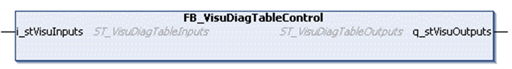

# FB_VisuDiagTableControl - Functional Description

FB\_VisuDiagTableControl - Functional Description

Overview

|  |  |
| --- | --- |
| Type: | Function block |
| Available as of: | V1.0.0.0 |

Functional Description

This function block is used to control the display of the visualization DiagTable provided with this library.

The visualization provides two parameters (i\_stVisuInputs, q\_stVisuOutputs) which can be directly assigned with the corresponding interface parameters of the function block.

The function block must be called cyclically in your application. It is a good practice to call it in a separate task with low priority and an interval greater or equal than 50 ms.

Interface

| Input | Data type | Description |
| --- | --- | --- |
| i\_stVisuInputs | [ST\_VisuDiagTableInputs](../Structures/Structures-10.htm#XREF_D_SE_0097664_1) | Input commands linked to the visualization. |

The elements of ST\_VisuDiagTableInputs are initialized as follows:

ostFilteroptions:

oxInfos := TRUE

oxWarnings := TRUE

oxErrors := TRUE

oxSourceFbGetDiag := TRUE

oxSourceMotionKernel := TRUE

| Output | Data type | Description |
| --- | --- | --- |
| q\_stVisuOutputs | [ST\_VisuDiagTableOutputs](../Structures/Structures-11.htm#XREF_D_SE_0097665_1) | Output commands linked to the visualization. |

EIO0000003927.01

© 2019 Schneider Electric. All rights reserved.