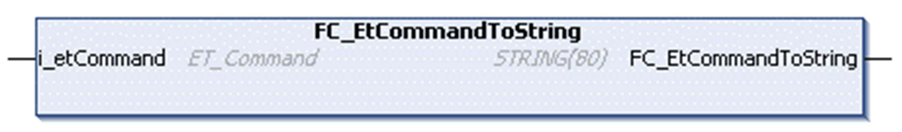

# FC_Et•••ToString

FC\_Et•••ToString

Overview

Example of one of the EnumToString conversion functions.

Task

Converts a variable of the corresponding [enumeration type](../Enumerations/Enumerations-1.htm#XREF_D_SE_0080733_1) to a variable of type STRING.

Interface

| Input | Data type | Description |
| --- | --- | --- |
| i\_etCommand | Corresponding enumeration of this library. | Enumeration to be converted. |

Return Value

| Data type | Description |
| --- | --- |
| STRING(80) | Provides the corresponding text. |

EIO0000003927.01

© 2019 Schneider Electric. All rights reserved.