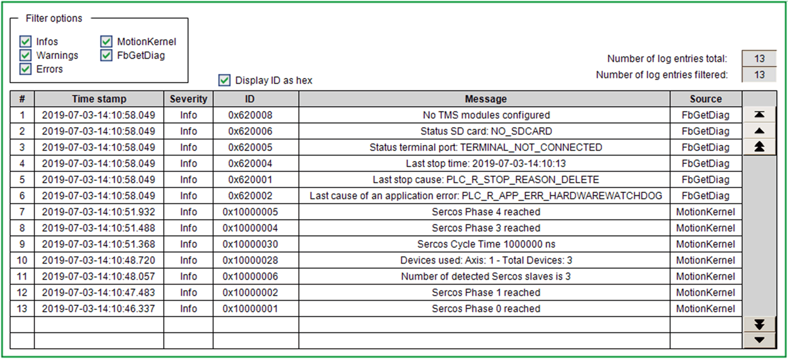

# DiagTable

DiagTable

Overview

|  |  |
| --- | --- |
| Type: | Visualization |
| Available as of: | V1.0.0.0 |
| Implements: | - |

Task

Display the diagnostic messages out of the [GVL.G\_astDiagTable](../Global_Variable_List/Global_Variable_List.htm#XREF_D_SE_0097636_1).

Functional Description

This visualization is used to display the diagnostic messages out of the [GVL.G\_astDiagTable](../Global_Variable_List/Global_Variable_List.htm#XREF_D_SE_0097636_1). The visualization must be instantiated within a frame visualization in the application.

Interface

| Input/Output | Data type | Description |
| --- | --- | --- |
| iq\_stVisuInputs | [ST\_VisuDiagTableInputs](../Structures/Structures-10.htm#XREF_D_SE_0097664_1) | Commands linked to the input of the corresponding function block. |
| iq\_stVisuOutputs | [ST\_VisuDiagTableOutputs](../Structures/Structures-11.htm#XREF_D_SE_0097665_1) | Signals linked to the output of the corresponding function block. |

EIO0000003927.01

© 2019 Schneider Electric. All rights reserved.