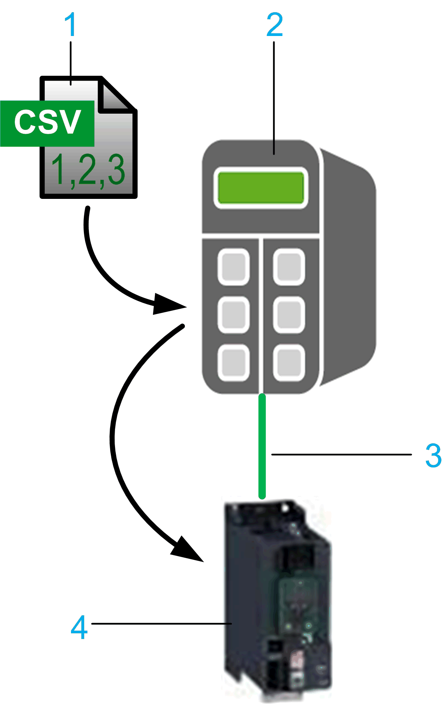

# Presentation of the Library

Presentation of the Library

General Information

Library Overview

The SercosDriveUtility library allows you to read and write your drive configuration using the Sercos III fieldbus network.

The SercosDriveUtility library provides the following functions:

oReading and storing drive parameters in the controller using the FB\_ParameterUpload.

oWriting and storing parameters to the drive from the controller using the FB\_ParameterDownload.

The library saves and restores the drive parameters specified by an Index File in the controller. You may have multiple Index Files, one for each drive on the network. The Index File is formatted as a Character Separated Values (CSV) file.

To initially create the Index file, you can use any common editor. To write the file to the controller, the library FileFormatUtility is used. For further information, refer to CSV Function Blocks ([see EcoStruxure Machine Expert, FileFormatUtility, Library Guide](../front/front-4.htm#XREF_D_SE_0081461_11)).

Another file, referred to as the Parameter File, is where the parameter data is stored for the specific drive. You may have multiple Parameter Files, one for each drive on the network that may have parameters. The Parameter File is also formatted as a CSV file, and is automatically created upon upload of the parameters specified by the Index File.

FB\_ParameterUpload

You can upload the values of parameters of a Sercos drive and store them in a Parameter File in the controller.

As a prerequisite for data uploading between the controller and the drive, a specific Character Separated Values (CSV) file must be available on the PacDrive LMC controller. This Index File must contain a list of all parameters of a Sercos drive you want to upload and save in a specified syntax. For further information, refer to the chapter [Index File](../Specifications/Specifications-2.htm#XREF_D_SE_0081722_1) and the manual of the supporting drive.

Reading and storing parameters in the controller using the FB\_ParameterUpload:

1   Index File saved in the PacDrive LMC controller

2   PacDrive LMC controller

3   Parameter File saved in the PacDrive LMC controller

4   Sercos bus

5   Supported Drive, for example ATV340S

FB\_ParameterDownload

You can download the values of parameters of a drive supporting Sercos III, and store them in the nonvolatile memory of the drive.

As a prerequisite for data downloading from the controller to the drive, a CSV Parameter file must be available on the PacDrive LMC controller.

This Parameter File is created by executing FB\_ParameterUpload and contains the drive parameters you want to restore in the specified syntax.

For further information, refer to the chapter [Parameter File](../Specifications/Specifications-4.htm#XREF_D_SE_0081727_1).

Restoring parameters in the drive using the FB\_ParameterDownload:

1   Parameter File saved in the PacDrive LMC controller

2   PacDrive LMC controller

3   Sercos bus

4   Supported Drive, for example ATV340S

Characteristics of the Library

The table indicates the characteristics of the library:

| Characteristic | Value |
| --- | --- |
| Library title | SercosDriveUtility |
| Company | Schneider Electric |
| Category | Devices |
| Component | SercosDriveUtility |
| Default namespace | SDU |
| Language model attribute | [qualified-access-only](../../../../../../api/crossBook?lang=en-US&virtualBookName=SoLibref&topicID=D_SE_0081219_10) |
| Forward compatible library | [Yes](../../../../../../api/crossBook?lang=en-US&virtualBookName=SoLibref&topicID=D_SE_0081226_1) |

NOTE: For this library, qualified-access-only is set. Therefore, the [POUs](../glossary/glossary.htm#XREF_D_SE_0076433_158) (program organization unit), data structures, enumerations, and constants have to be accessed using the namespace of the library. The default namespace of the library is SDU.

EIO0000003397.00

© 2018 Schneider Electric. All rights reserved.