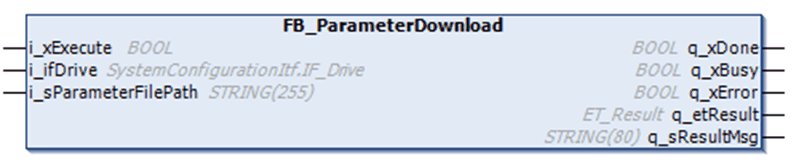

# FB_ParameterDownload - Functional Description

FB\_ParameterDownload - Functional Description

Overview

|  |  |
| --- | --- |
| Type: | Function block |
| Available as of: | V1.0.2.0 |

Functional Description

The function block downloads (writes to the drive) the values of all parameters defined in the [Parameter File](../Specifications/Specifications-4.htm#XREF_D_SE_0081727_1) and saves them in the nonvolatile memory of the drive.

To write or read CSV files to or from the controller, the library FileFormatUtility is used. For further information, refer to the CSV Function Blocks chapter of the [FileFormatUtility Library Guide](../../../../../../api/crossBook?lang=en-US&virtualBookName=formatLi&topicID=D_SE_0080776_1).

Interface

| Input | Data type | Description |
| --- | --- | --- |
| i\_xExecute | BOOL | The function block opens the specified Parameter File and writes the specified content to the drive upon a rising edge of this input.  Data at the inputs are latched internally; changes during execution have no effect.  Also refer to, [Behavior of Function blocks with the Input i\_xExecute](../Common_In_Out/Common_In_Out.htm#XREF_D_SE_0069766_1). |
| i\_ifDrive | SystemConfigurationItf.IF\_Drive | The symbolic name of the drive to download parameter. |
| i\_sParameterFilePath | STRING [255] | File path and file name of the Parameter File which contains the specified parameters as defined in the Index File of the specified drive.  If a file name is specified without the .csv file extension, the function block adds the extension .csv. |

| Output | Data type | Description |
| --- | --- | --- |
| q\_xBusy | BOOL | If this output is set to TRUE, the function block execution is in progress.  If the function block execution is stopped due to successful completion, by a detected error or aborted, this output is set to FALSE by the function block. |
| q\_xDone | BOOL | If this output is set to TRUE, the execution has been completed successfully. |
| q\_xError | BOOL | If this output is set to TRUE, an error has been detected. For details, refer to q\_etResult and q\_etResultMsg. |
| q\_etResult | ET\_Result | Indicates the present operating state and the result of the execution of the function block as a numeric value. |
| q\_sResultMsg | STRING [80] | Indicates the present operating state and the result of the execution of the function block as a text message. |

EIO0000003397.00

© 2018 Schneider Electric. All rights reserved.