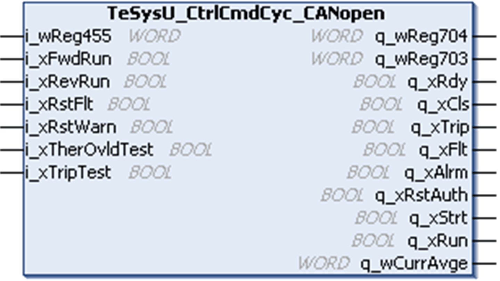

# Functional Description

Functional Description

Function Block Description

The TeSysU\_CtrlCmdCyc\_CANopen function block is dedicated to the control and command of a single TeSysU motor starters (up to 32 A/15 kW/20 hp) through TeSysU registers exchanged through CANopen [PDOs](../glossary/glossary.htm#XREF_D_SE_0024697_88).

TeSysU Compliance

The TeSysU\_CtrlCmdCyc\_CANopen function blocks are compliant with the following TeSysU sub assemblies:

| Type | Subassembly Name |
| --- | --- |
| Power base | oLUBxx non-reversing power base (up to 32 A/15 kW/20 hp)  oLU2Bxx reversing power base (up to 32 A/15 kW/20 hp) |
| Control unit | oLUCA standard control unit  oLUCB, LUCC, and LUCD advanced control units  oLUCM multi-function control unit  oLUCL magnetic control unit |
| Communication module | oLULC08 CANopen communication module |

Pin Diagram

This figure shows the pin diagram of the TeSysU\_CtrlCmdCyc\_CANopen function block:

EIO0000002929.00

© 2019 Schneider Electric. All rights reserved.