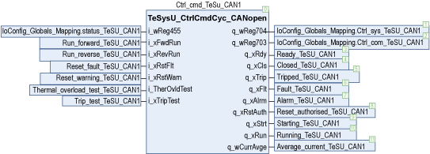
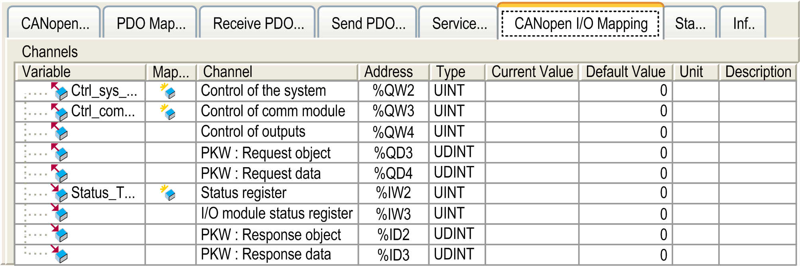

# Instantiation and Usage Example

Instantiation and Usage Example

Instantiation and Usage Example

This figure shows an instantiation example of the TeSysU\_CtrlCmdCyc\_CANopen function block:

This figure shows a visualization for the associated CANopen I/O Mapping dialog of TeSysU:

EIO0000002929.00

© 2019 Schneider Electric. All rights reserved.