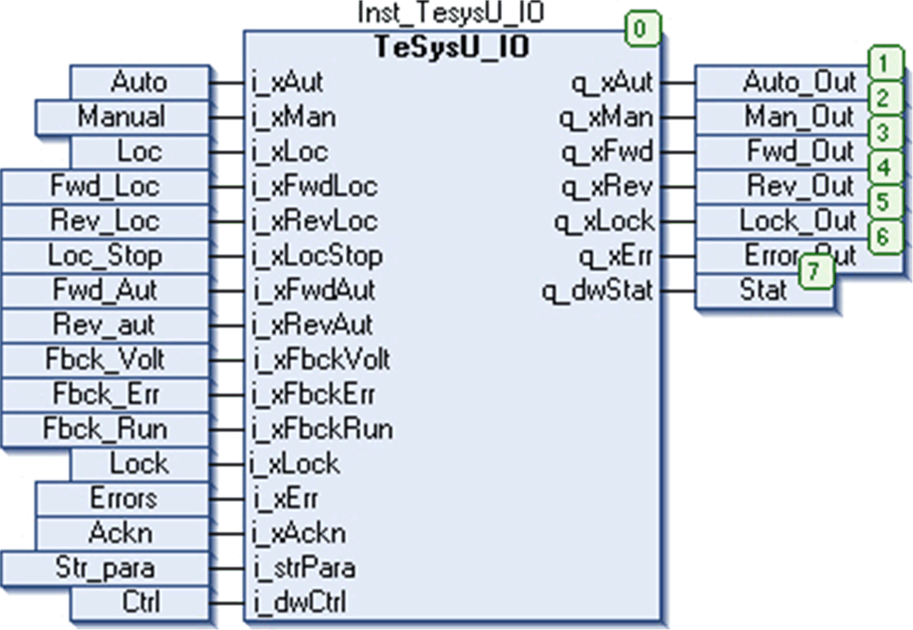

# Instantiation, Usage Example and Limitations

Instantiation, Usage Example and Limitations

Instantiation and Usage Example

This figure shows an instance of the TeSysU\_IO function block in online mode of EcoStruxure Machine Expert:

Auto mode is selected through the pin i\_xAut which is indicated at the output q\_xAut. The motor is given command to run in forward direction through the input pin i\_xFwdAut as indicated at the output q\_xFwd. The feedback signal i\_xFbckRun signal is high.

Limitations

The motor is running (q\_xFwd = 1 or q\_xRev = 1), and feedback signal is active (i\_xFbckRun = 1). Now if interlock occurs (i\_xLock = 1) for a duration more than iFbckDly seconds specified at the input i\_strPara, an error is detected.

EIO0000002929.00

© 2019 Schneider Electric. All rights reserved.