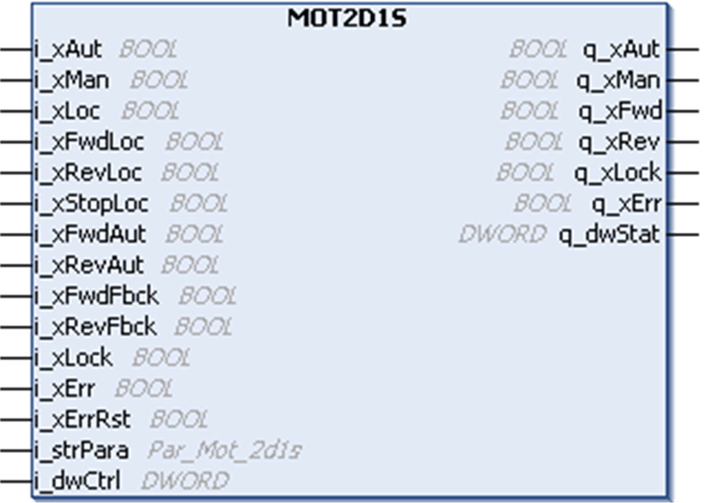

# Functional Description

Functional Description

Function Block Description

The MOT2D1S generic function block is dedicated to the control and command of motors with two directions of rotation and one speed through any actuator connected in parallel through digital I/Os or through communication networks like Modbus Serial Line or CANopen.

The motor can be controlled through 3 different operating modes : automatic, manual using push-buttons, or manual using HMI.

Pin Diagram

This figure shows the pin diagram of the MOT2D1S function block:

Operation Modes

The MOT2D1S function block has three modes of operation:

oAutomatic Mode: The Automatic mode is selected through the input i\_xAut. In Automatic mode, the motor is started and stopped in the forward direction through the input pin i\_xFwdAut, regardless of the activation of local mode. Similarly, the reverse direction is handled with the input i\_xRevAut. These inputs are controlled by the controller process application during normal functioning.

oManual Mode: The Manual mode is activated by the pin i\_xMan.

Case 1: Local mode is not activated. The motor is started and stopped through the bit commands of the signal i\_dwCtrl. This double word can be associated to an external HMI equiped with a keypad.

Case 2: Local mode is activated through the input pin i\_xLoc. The motor is started through the inputs i\_xFwdLoc and stopped via i\_xLocStop in forward direction, and the inputs i\_xRevLoc and i\_xLocStop are used to manually control the motor in reverse direction. These digital inputs can be linked to connect push-buttons.

oLocal Mode: The local mode is activated by an input pin i\_xLoc and is set additionally to the automatic or manual mode. The local mode does not influence the automatic mode, but changes the source for manual operation.

The block is de-activated on controller start and remains in the same operation mode, unless a new one is selected. If both automatic and manual modes are selected simultaneously (inputs i\_xAut and i\_xMan are set to 1), the operation mode is invalid, which is indicated at the q\_xErr output.

NOTE: If the operation mode is changed from manual mode to automatic mode, a running motor is turned off. Any other change of the operation mode does not affect the motor operation.

Starting in Reverse Direction

The motor cannot be started in reverse direction, when already running in forward (output q\_xFwd set to 1) and vice versa. This direct change between the two directions can be avoided by proper time supervision. The delay time for the change of direction can be freely chosen through the structure element iRevDly at the input i\_strPara. If the time is set to 0, the change takes place immediately.

Supervising the Motor

The operation of the motor is supervised by feedback signal (i\_xFwdFbck), which indicates the running motor. The feedback signal must adjust its value to the value of the related output q\_xFwd within a defined time. If the time is exceeded, the block indicates a detected error (Missing Feedback detected error). The time can be set via the structure element iFbckDly at input i\_strPara. The supervision can be switched off by the structure element xEnFb at the input i\_strPara.

Running the Motor

The motor can run, only if the interlock input i\_xLock is set to 0. An active interlock signal inhibits the start/stop of the motor. When the interlock signal returns to 0 the motor is restarted. An active interlock is indicated at the output q\_xLock.

The motor can run only if the output q\_xErr is set to 0. An active detected error signal inhibits the start or stop of the motor. The function block sets the detected error signal, if the detected error input i\_xErr is set to 1 (external detected error) or in case of an invalid operation mode or a missing feedback signal (internal detected errors).

Resetting a Detected Error

The single detected errors are indicated in the HMI as alarms. To reset the detected error output, the detected error has to be acknowledged by a rising edge on the input i\_xAckn or by using the 16th bit of the signal i\_dwCtrl.

EIO0000002929.00

© 2019 Schneider Electric. All rights reserved.