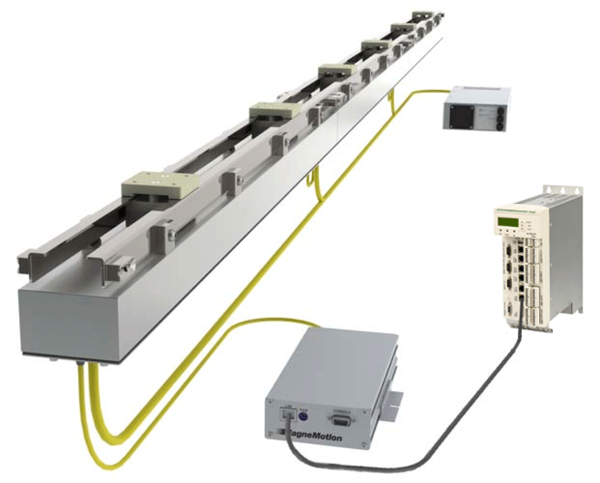

# Concept and Basic Settings

Concept and Basic Settings

Overview

The function block FB\_Connection provides a functional interface for monitoring and controlling a MagneMotion transport system using PacDrive LMCs of Schneider Electric.

The MagneMotion transport system is a flexible alternative to conventional conveyor belt architectures. It consists of modular building blocks – straight elements, curves and switches – that can be combined to create individual track layouts.

Examples for a typical field of application are

oLimited space and/ or geometric configurations of the factory that demand a space-efficient and flexible solution to connect different machines and processes.

oManaging product flows where each item is transported separately and may have different processes during the course of production.

NOTE: This function block only supports the version MagneMover LITE which can handle payloads of up to 2 kg per vehicle.

EIO0000002206.00

© 2018 Schneider Electric. All rights reserved.