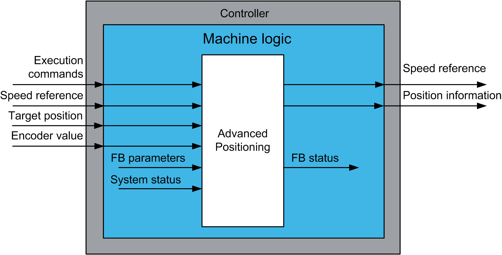

# Functional Overview

Functional Overview

Functional Overview

Why Use the AdvancedPositioning Function Block?

Although high performance positioning applications are the domain of servo drives with synchronous motors, asynchronous motors with variable speed drives offer performance that is sufficient for many applications. The function block extends the functionality of the variable speed drive by adding a position control function.

This function block is intended to have significant influence on the physical movement of its controlled axis and its load. The application of this function block requires accurate and correct input parameters in order to make its movement calculations valid and to avoid hazardous situations. If invalid or otherwise incorrect input information is provided by the application, the results may be undesirable.

|  |
| --- |
| Warning_Color.gifWARNING |
| UNINTENDED EQUIPMENT OPERATION |
| Validate all function block input values before and while the function block is enabled. |
| Failure to follow these instructions can result in death, serious injury, or equipment damage. |

Solution with the AdvancedPositioning Function Block

The AdvancedPositioning FB provides a solution for position control of a single axis driven by a variable speed drive.

Functional View

EIO0000003890.01

© 2020 Schneider Electric. All rights reserved.