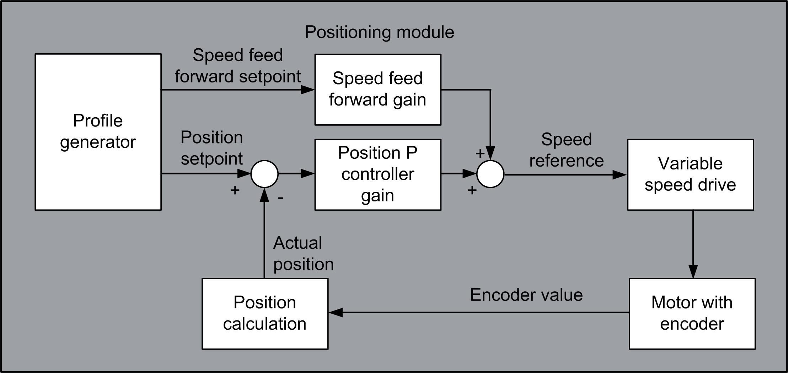

# Architecture

Architecture

Architecture

System Requirements

For details concerning the system requirements, refer to the chapter [System Requirements](../System_Requirements/System_Requirements-1.htm#XREF_D_SE_0003458_1).

Data Flow Overview

Internal structure of the AdvancedPositioning FB

Internal structure of the positioning module

EIO0000003890.01

© 2020 Schneider Electric. All rights reserved.