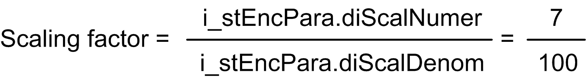
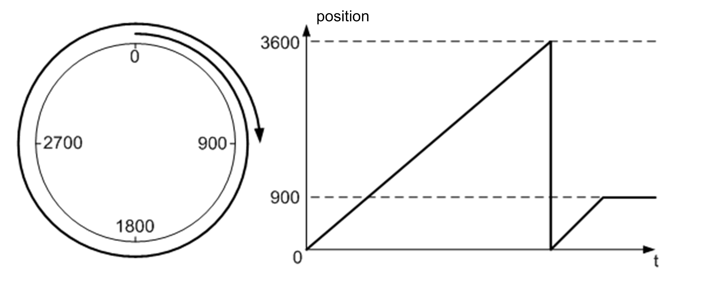
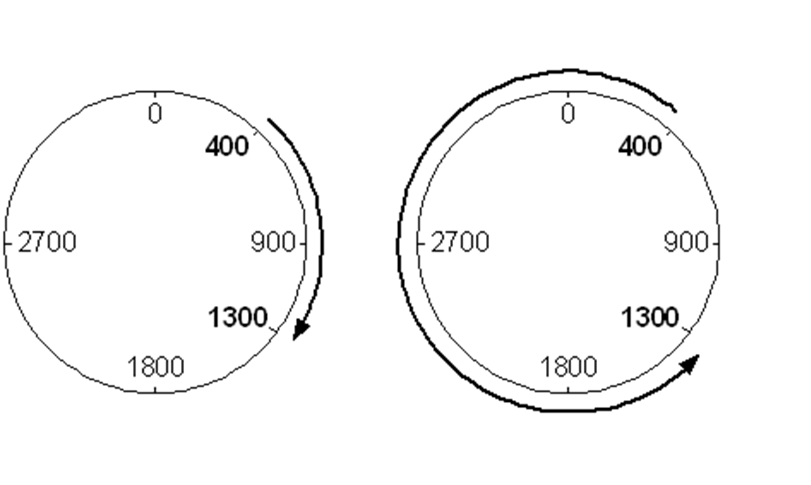
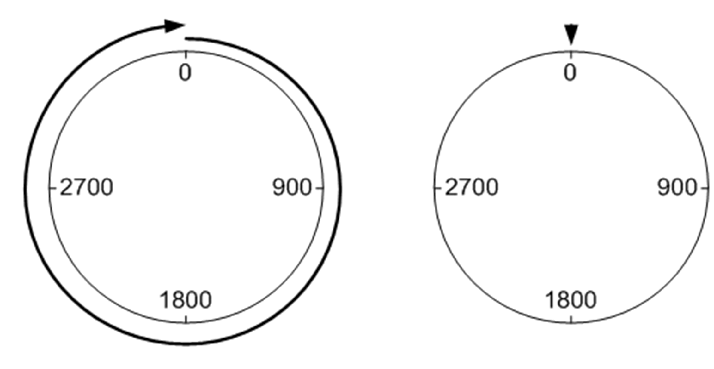

# Structured Parameter - stEncPara

Structured Parameter - stEncPara

Structure: stEncPara

Structure of parameters related to encoder interface.

| Parameter | Data type | Description |
| --- | --- | --- |
| wIntfResol | WORD | Bit resolution of encoder interface.  Range: 1...32  Default value: 16  Refer to detailed description below this table. |
| diPulsPerRevo | DINT | Defines the number of encoder increments/pulses per revolution of the motor.  To change this parameter is only possible when i\_xDrvRun = FALSE.  Range: 1...2147483647  Default value: 1024 |
| xEncType | BOOL | Encoder type selection.  TRUE: Absolute encoder  FALSE: Incremental encoder  Refer to detailed description below this table. |
| xPosIncSave | BOOL | Save calculated absolute position when used with incremental encoder.  TRUE: Saved  FALSE: Not saved  Refer to detailed description below this table. |
| xMoveInDsbl | BOOL | Movement in disabled state.  TRUE: Movement allowed  FALSE: Movement not allowed  Refer to detailed description below this table. |
| diScalNumer | DINT | Numerator for position scaling.  Range: 1...2147483647  Default value: 1  Refer to detailed description below this table. |
| diScalDenom | DINT | Denominator for position scaling.  Range: 1...2147483647  Default value: 1024  Refer to detailed description below this table. |
| xModulo | BOOL | Selection between linear and modulo axis.  TRUE: Modulo axis  FALSE: Linear axis  Refer to detailed description below this table. |
| diModRng | DINT | Range of modulo axis.  Range: 0...2147483647  Default value: 3600  Scaling/Unit: user units  Refer to detailed description below this table. |
| wModDir | WORD | Direction of modulo movement.  Range: 0...2  Default value: 0  Refer to detailed description below this table. |
| xModMultiRng | BOOL | Multi-range modulo movement.  Default state: FALSE  Refer to detailed description below this table. |

wIntfResol

This parameter defines the bit resolution of used encoder interface:

16 bit resolution for the internal encoder interface of Altivar drives

25 bit resolution for the interface of absolute encoders of the XCC range

32 bit resolution for interfaces of integer type (-2147483648...2147483647)

NOTE:  32 bit interfaces of unsigned type (0 to 4294967296) are not supported.

Change of this parameter is possible only when i\_xDrvRun = FALSE.

xEncType

FALSE selects an incremental encoder. Incremental encoder in this context means, that after power cycle of the machine, the value of encoder position on the input i\_diEncVal is reset to 0.

TRUE selects an absolute encoder which retains its position value through a power cycle.

This information is important for correct function of the FB which calculates the internal position of the axis based on information from the encoder interface.

|  |
| --- |
| Warning_Color.gifWARNING |
| UNINTENDED EQUIPMENT OPERATION |
| Remove the power of the incremental encoder interface every time the controller is switched off. |
| Failure to follow these instructions can result in death, serious injury, or equipment damage. |

For example, when using the internal encoder interface of Altivar drives, it is necessary to switch the drive off and let the encoder value of the drive reset to zero every time the controller is restarted.

xPosIncSave

This parameter is only taken into account if an incremental encoder is used (i\_stEncPara.xEncType=FALSE).

It configures whether the FB retains the internal absolute position during a power cycle or not. When i\_stEncPara.xPosIncSave is FALSE, the internal absolute position is not retained and you need to perform homing after every start of the machine.

NOTE: If the drive remains under power while power is removed from the controller, the incremental encoder interface within the drive will retain its value. Once the controller is restarted, and if the parameter i\_stEncPara.xEncType=TRUE, you can use the incremental encoder interface as a pseudo-absolute encoder.

In this case, the FB does not store the value of encoder interface when the controller is powered down. It stores only the information about number of overflows of the encoder interface of the drive and establishes the internal absolute position using the position information from incremental encoder interface of the drive. If the drive had been reset (either through power cycled or product reset) and the encoder position is reset (equal to zero), you must perform a new homing.

xMoveInDsbl

If the axis can move while the drive or FB is disabled or while the machine is powered off, set this parameter to TRUE. This parameter makes the planned position of the FB follow its actual position while the drive is not in RUN state. This helps preventing excessive acceleration applied to the axis.

If the axis position is fixed by a brake in disabled state or if the axis cannot move on its own, set this input to FALSE.

diScalNumer / diScalDenom

These parameters are the numerator and denominator values used for position value scaling. These values are used to calculate the scaling factor. The scaling factor defines the relationship between the number of motor revolutions and the corresponding distance in user units.

For example, when the axis movement by 10 mm corresponds to seven motor revolutions, set

o i\_stEncPara.diScalNumer=7 and

o i\_stEncPara.diScalDenom=10.

This will configure the user unit to 1 mm.

If a higher resolution is needed, set the i\_stEncPara.diScalDenom=100. This will configure the user unit to 0.1 mm

Similarly, the FB may be configured for positioning in angular units.

When one revolution of the machine axis (gearbox output shaft) corresponds to 15.5 revolutions of the motor, and the required resolution is 0.1°, then set the

oi\_stEncPara.diScalNumer=155 and

o i\_stEncPara.diScalDenom=36000.

Numerator and denominator that are not relatively prime can be divided by their greatest common divisor.

In this case, it is 5. That results in:

You can change these parameters only when i\_xDrvRun = FALSE. When the axis is in Modulo mode, homing using homing method 35 is automatically performed on change of i\_stEncPara.diScalNumer or i\_stEncPara.diScalDenom.

xModulo

With this parameter, you can select between positioning of linear (FALSE) and rotary (TRUE) axis. In Modulo mode is the position of the axis defined on a range between 0 and i\_stEncPara.diModRng.

Modulo mode is useful for positioning of axes turning in one direction because it helps prevent uncontrolled overflow of internal position.

Limit switch function (both, hardware and software) is disabled in Modulo mode.

Modulo movement is supported in both, absolute and relative modes, depending on setting of input i\_xPosMode.

Following images show movement with

oi\_diPosTarg = 900 and

owModDir = 1.

The left image shows positioning in absolute mode, the right image positioning in relative mode.You can change this parameter only when i\_xDrvRun = FALSE. When the axis is in Modulo mode, homing using homing method 35 is automatically performed on change of i\_stEncPara. xModulo.

Position in modulo movement

diModRng

The value must be higher than 0 when i\_stEncPara.xModulo = TRUE.

For example, the modulo range can be 3600 for a modulo axis with 360° rotation range. This gives the axis a resolution of 0.1°.

Following figure depicts change of position in time of modulo movement with i\_stEncPara.diModRng = 3600.

You can change this parameter only when i\_xDrvRun = FALSE. Homing using homing method 35 is automatically performed on change of i\_stEncPara.diModRng.

Position in modulo movement

wModDir

This parameter defines direction of rotation of a modulo axis. Supported values are:

0 shortest distance

1 positive direction (forward)

2 negative direction (reverse)

The left figure shows movement in modulo directions 0 and 1, the right one movement in direction 2.

Modulo direction

xModMultiRng

With this parameter, you can select between positioning within one revolution of the modulo axis (i\_stEncPara.xModMultiRng = FALSE) and positioning over multiple modulo ranges (i\_stEncPara.xModMultiRng = TRUE).

It can be used to perform positioning tasks ending at the same position as the starting position (whole-number multiples of modulo range) or tasks exceeding modulo range.

The following example describes a positioning task with

otarget position i\_diPosTarg = 3600,

oon modulo range i\_stEncPara.diModRng = 3600,

owith wModDir = 1,

ostarting in position 0.

The diagram on the left side shows behavior in multiple-range mode and the one on the right behavior in the single range mode. In single range mode is the target position equal to the actual position and therefore the axis does not move.

Moving by whole-number multiples of modulo range

Following figures depict a positioning task

ostarting in position 0,

owith target position i\_diPosTarg = 4500,

oon modulo range i\_stEncPara.diModRng = 3600,

owith wModDir = 1.

The left figure shows positioning within one modulo range and the right one positioning over multiple modulo ranges.

Single and multi range mode

Multiple range mode is supported only in modulo directions 1 (positive) and 2 (negative). Mode 0 (shortest distance) is not supported.

Single and multiple-range mode positioning tasks are supported in both, absolute and relative positioning modes.

EIO0000003890.01

© 2020 Schneider Electric. All rights reserved.