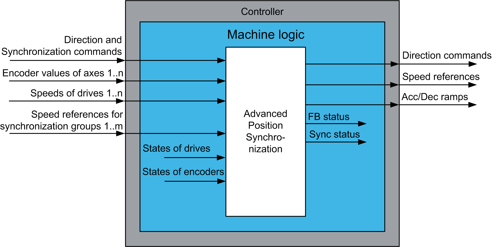

# Functional Overview

Functional Overview

Functional Overview

Why Use the AdvancedPositionSync Function Block?

The function block can synchronize multiple linear axes of a crane with identical or different motors, gears, and encoders. The function block can retain information about positions of synchronized axes and their synchronization status when the machine is powered down. Thus, the synchroni­zation can continue after power cycle of the machine.

This function block is intended to have significant influence on the physical movement of the machine and its load. The application of this function block requires accurate and correct input parameters in order to make its movement calculations valid and to avoid hazardous situations. If invalid or otherwise incorrect input information is provided by the application, the results may be undesirable.

|  |
| --- |
| Warning_Color.gifWARNING |
| UNINTENDED EQUIPMENT OPERATION |
| Validate all function block input values before and while the function block is enabled. |
| Failure to follow these instructions can result in death, serious injury, or equipment damage. |

Solution with the AdvancedPositionSync Function Block

The AdvancedPositionSync function block provides a solution for position synchronization of multiple linear axes of a crane.

Functional View

EIO0000003890.01

© 2020 Schneider Electric. All rights reserved.