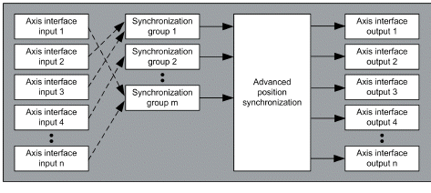

# Architecture

Architecture

Architecture

System Requirements

The speed references are written to Altivar variable speed drives. The function block requires a position feedback from all synchronized axes.

For details concerning the system requirements, refer to the chapter [System Requirements](../System_Requirements/System_Requirements-1.htm#XREF_D_SE_0003458_1).

Environment

When the motor moves in forward direction, the value corresponding to the position of the axis must increase and when the motor moves in reverse direction, the value corresponding to the position of the axis must decrease.

Data Flow Overview

Assignment of axes to synchronization groups

Structure of a single synchronization group

EIO0000003890.01

© 2020 Schneider Electric. All rights reserved.