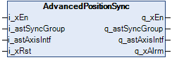
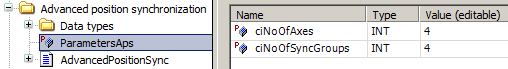

# Function Block Description

Function Block Description

AdvancedPositionSync Function Block

Pin Diagram

Functional Description

The function block uses information about positions of axes to synchronize their positions.

The function block supports both incremental and absolute encoders.

A difference of positions of synchronized axes is an input of a proportional controller within the function block (hereafter referred to as the position controller).

The output of the controller is then used to correct speeds of all synchronized axes.

Number of axes that can be synchronized is limited by computational performance of the controller, its memory and the fieldbus.

Configuration of Parameter List

The number of synchronization groups and the number of axes is defined by parameters within the Library Manager. The setting influences all instances of the function block instantiated within one application.

Definition of number of axes and synchronization groups

Synchronization Groups and Axis Interfaces

Synchronization groups and axis interfaces are the channels connecting the function block to the application.

The input and output variables are arrays of structures. The dimensions of these arrays depend on the configured number of synchronization groups and axis interfaces.

The axis interface input informs the function block about status and configuration of the connected axis.

The axis interface output gives commands, target speeds, and ramps to a variable speed drive or a nested synchronization group.

The synchronization group input is used by your application to give commands, target speeds, and ramps to a group of axes that move synchronously.

The synchronization group output informs about actual status of the group.

Assignment of Axes to Synchronization Groups

The axes can be freely assigned to any arbitrary synchronization group. There must be at least one axis in a group to allow the group to enter and remain synchronous state. When the last axis leaves a synchronization group, synchronous state of the group is terminated.

All axes within the synchronization group must stop in order for an axis to leave or enter a synchronization group. This rule does not apply if the axis has the xInstSync parameter set to TRUE. Setting this parameter to TRUE allows the axis to enter or leave synchronization groups at will.

Simultaneous Usage of Multiple Axis Groups

Multiple synchronization groups can move simultaneously and independently.

Usage of Axes Not Belonging to Any Synchronization Group

Axes not belonging to any synchronization group can move independently of other axes.

Alarm States and Propagation of Alarms

The movement of an axis is stopped if the axis is in alarm state. If an axis which is part of a synchronization group enters an alarm state, the alarm is propagated to the synchronization group and all axes within this group are likewise stopped.

Nesting of Synchronization Groups

The function block supports a nesting of synchronization groups. Multiple physical and virtual axes may be synchronized in a synchronization group. This topic is further discussed in the chapter describing [commissioning of the function block](Advanced_Position_Synchronization-15.htm#XREF_D_SE_0091461_3).

Position Offset

The function block allows the assignment of position offsets to axes connected to the function block via axis interfaces using the parameter i\_astAxisIntf.rPosOfst.

There are two ways to use the offset parameter.

oAn axis which is already part of a synchronization group gets a requested offset value. When there is a direction command present, the axis moves to a position which is defined by the sum of mean position of all axes within the synchronization group and the offset value of this particular axis.

The direction of movement towards this point depends on the parameter i\_astSyn­cGroup.xFlexDir. Maximum speed of the movement depends on i\_astAxisIntf.wDrvHsp parameter of the given axis and the acceleration and deceleration ramps on i\_astAxisIntf.wDrvAcc and i\_astAxisIntf.wDrvDec.

The axis keeps the position offset as long as the value of the input i\_astAxisIntf.rPosOfst is not modified.

oAn axis which has a non-zero value on the input parameter i\_astAxisIntf.rPosOfst when it enters a synchronization group is considered to be synchronized with the position offset defined by this value. This feature can be used for example to put the axis in line with the other synchronized axes.

Position offsets can be modified during movement. However, modifying the position offset during acceleration, deceleration or direction change can lead to increased position deviation of axes within the synchronization group.

EIO0000003890.01

© 2020 Schneider Electric. All rights reserved.