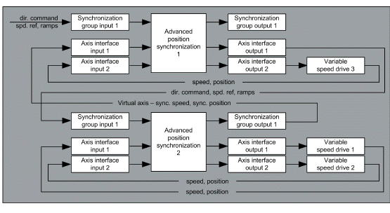
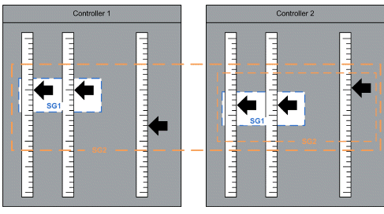

# Commissioning Procedure

Commissioning Procedure

Commissioning of Variable Speed Drives

| Step | Action |
| --- | --- |
| 1 | Set the drives to factory settings. |
| 2 | Configure correct motor control parameters. |
| 3 | Configure the brake logic control. |
| 4 | Perform motor tuning and encoder test. |
| 5 | If possible, set the motor control mode to FVC. |
| 6 | In drive menu application functions, disable preset speeds. Set command and reference channel to the fieldbus used. |
| 7 | Configure communication parameters. A power cycle of the drive is required after a modification of communication configuration. |
| 8 | In settings menu set the K speed loop filter to 100. This parameter influences how accurately the actual speed follows the target speed. The higher the value the more accurately Altivar drive responds to changing target speed. If motor speeds or torque tend to oscillate, it is possible to lower the value at a cost of lowering precision of position synchronization. |

Commissioning the AdvancedPositionSync Function Block

| Step | Action |
| --- | --- |
| 1 | Add an Altivar drive to the fieldbus communication configuration.  Configure the communication objects:  oController to drive  Command word, Target speed, Acceleration, Deceleration  oDrive to controller  Status word, Actual speed (Control effort), Encoder position value (PUC), Motor current |
| 2 | Configure the number of axes and synchronization groups in the Library Parameters tab of the Library Manager.  ociNoOfAxes  oCiNoOfSyncGroups |
| 3 | Instantiate the AdvancedPositionSync function block in your program and parameterize it with initial parameters. Configure the nominal and linear speeds for all axes. |
| 4 | Add the program containing execution of the instance of AdvancedPositionSync function block to a cyclic task. Keep the period of execution of this task as short as possible.  The length of the execution period impacts the accuracy of synchronization. Execution period up to 30 ms is sufficient for most of applications. Applications involving steep accelerations and high linear speeds require shorter execution periods. |
| 5 | Assign the communication variables to their respective axis interfaces. |
| 6 | Test the independent movement of all axes while they are not assigned to any synchronization group using the command inputs on axis interfaces. |
| 7 | Create the logic assigning the axes to synchronization groups. |
| 8 | Assign two axes to a synchronization group and give synchronization command to this axis group. |
| 9 | Verify that the axis group entered synchronized state. |
| 10 | Move the axes within the synchronization group using the direction commands of the synchronization group. |
| 11 | Fine-tune the proportional gain of position controller. If the speeds oscillate, decrease the proportional gain. If the deviation is too high and does not decrease, increase the proportional gain. |
| 12 | Add more axes to the synchronization group and test the performance. |
| 13 | Start a trace of actual speeds and actual position deviations of all axes within the synchronization group. Verify that the position deviations fulfill the precision requirements. |
| 14 | If the machine is manually controlled, test repeated starts and reversing of the movement. |

Specific Use Cases

The function block supports nested synchronization. A synchronization group can be seen as a virtual axis which can be further synchronized with other real or virtual axes within another synchronization group.

Nested Synchronization of Three Axes

There are three physical axes in this example. Two of them are synchronized together within the synchronization group 1. These two axes form a virtual axis which is further synchronized with the third physical axis within the synchronization group 2.

Nested synchronization

The function block uses the information from the output of the synchronization group 1 as a virtual axis. It then calculates a synchronous position and speed from the actual positions and speeds of the axes contained in the synchronization group 1.

This approach can be used for example if the axes within the synchronization group 1 are synchronized permanently and must be intermittently synchronized with another axis.

Following image describes the assignment of real and virtual axes to axis interfaces and the assignment of axis interfaces to axis groups.

Nested synchronization of three axes using one instance of the function block

Since the function block is executed once per cycle time, it takes effectively two execution cycles to synchronize both groups. This requires a short cycle time.

Alternatively, it is possible to use two instances of the function block for the nested synchronization.

Nested synchronization using two instances of the function block

This approach is equivalent to the previous one. It uses two instances of the function block to execute the nested synchronization within one period of the cyclic task.

Nested Synchronization of Six Axes Across Two Controllers

The approach described in the previous section can be taken one step further. It is possible to synchronize multiple axes across two or more controllers.

There are six physical axes and two controllers in this example. Each controller controls movement of three physical axes directly. The controller 2 groups the synchronized axes to a virtual axis and provides information about actual position and actual speed of this virtual axis to controller 1. Controller 1 then handles this virtual axis as one of the axes connected to its axis interfaces within its synchronization group 2.

Nested synchronization with two controllers

The diagram illustrates that the synchronization group 2 of controller 1 contains both synchroni­zation groups of the controller 2. This multiple nesting is possible at a cost of certain transport delay in the controlled system. It is necessary to keep this delay as short as possible. The key is reduction of the execution periods of tasks executing instances of the AdvancedPositionSync function block, reduction of delays in communication between the two controllers and the delays in communication between the controllers and drives.

The advantage of this approach is that only information about a single virtual axis has to be transferred between the controllers. If the synchronization of multiple axes connected to two separate controllers is fully handled by one of these controllers, it is necessary to transfer information about all axes that are currently synchronized.

The choice of the fieldbus to deploy between the two controllers depends on the application. It must be able to transfer a sufficient amount of data in a sufficiently short time and must have a low jitter.

Nested synchronization with two controllers using one instance of the function block per controller

EIO0000003890.01

© 2020 Schneider Electric. All rights reserved.