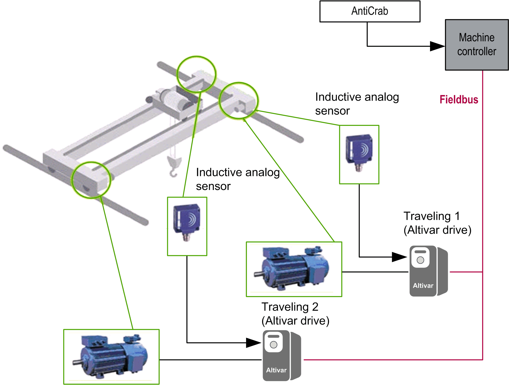

# Hardware Architecture

Hardware Architecture

Hardware Architecture Overview

The following figure is the [Machine](../glossary/glossary.htm#XREF_D_SE_0024697_519) View of Anti-crab in an industrial crane using two motors to move the bridge.

NOTE: Use identical drives for motors on both sides of the bridge.

A [configuration](../glossary/glossary.htm#XREF_D_SE_0024697_659) with 2 drives and 2 motors is the most commonly used configuration. It uses 1 drive and 1 motor for each of the wheel trucks, or bogies, of the crane.

|  |
| --- |
| Warning_Color.gifWARNING |
| UNINTENDED EQUIPMENT OPERATION |
| oEquip the bridge in industrial cranes with mechanical safeguards protecting the crane against de-railing and other damage.  oDo not use the FB without the proper mechanical safeguards integrated into the crane application. |
| Failure to follow these instructions can result in death, serious injury, or equipment damage. |

EIO0000003890.01

© 2020 Schneider Electric. All rights reserved.