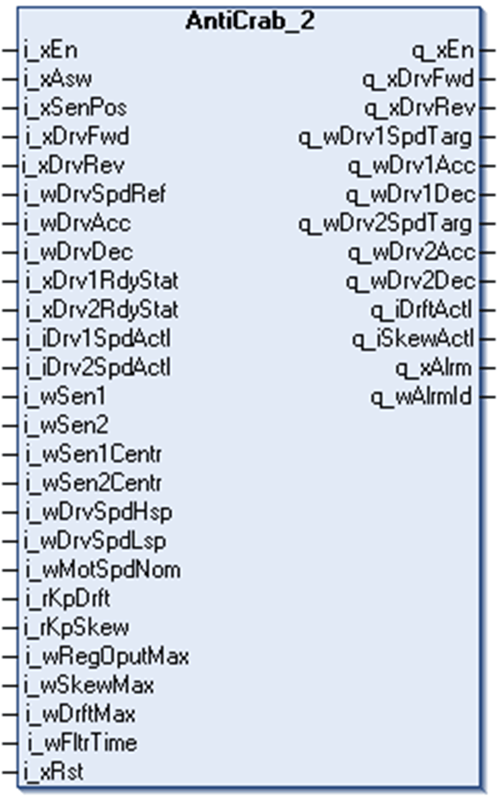
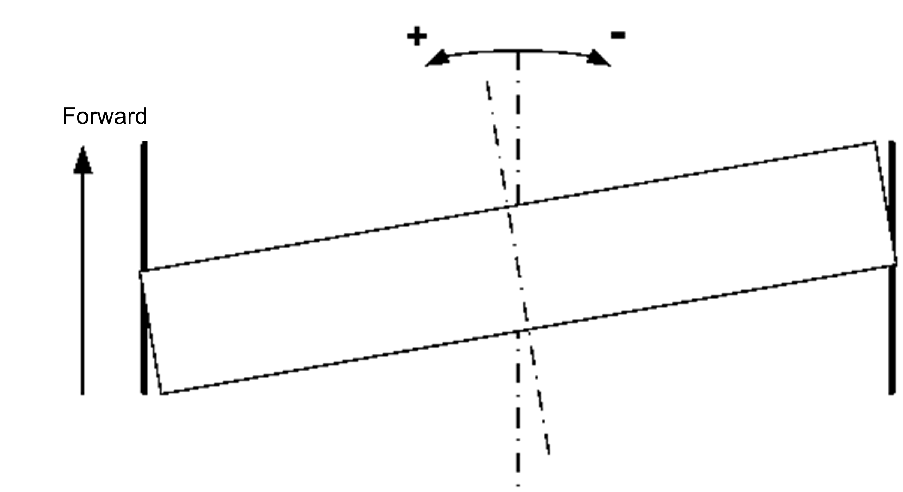
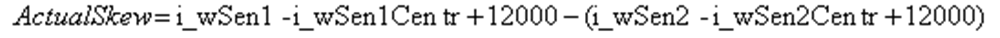
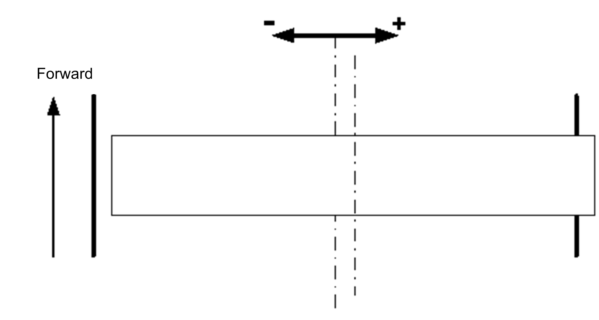
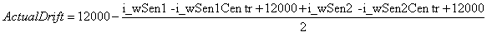

# Function Block Description

Function Block Description

AntiCrab\_2 Function Block

Pin Diagram

Functional Description

The Anti-crab function is designed to correct the skew and the drift of the bridge in industrial cranes.

Anti-crab function uses 2 analog sensors to measure distance from a crane runway rail or another surface parallel to the rail. Both sensors are placed on one side of one of the bogies. They can be placed in any of the positions corresponding to a) through d) in the following figure. The FB has to be aware of placement of the sensors to operate correctly. The information is given to the FB via i\_xSenPos input.

i\_xSenPos must be

oFALSE if sensors are mounted in positions a) or c) on the left side of the rail in forward direction, and

oTRUE if they are in positions b) or d) on the right side of the rail in forward direction.

The principle is illustrated in the following figure.

Skew and Drift

Skew is a misalignment of the transversal axis of the crane bridge and the longitudinal axis of the crane runway. The crane has no skew when these axes are parallel.

Bridge in industrial cranes in a positive skew situation:

The actual skew is calculated from the reading of the 2 sensors and the center positions of the sensors. Center positions are input values that help to compensate for an imperfect mechanical alignment of the sensors. The values are configured during commissioning.

The formula for calculation of actual skew:

when i\_xSenPos = FALSE and when i\_xSenPos = TRUE

The actual value of skew is available at the q\_iSkewActl output of the FB.

Drift is a lateral misalignment of the transversal axis of the bridge in industrial cranes and the longitudinal axis of the crane runway. There is no drift if the 2 axes intersect in the middle of the bridge in industrial cranes.

Bridge in industrial cranes in a positive drift situation:

The actual drift is calculated from the reading of the 2 sensors and the center positions of the sensors. Center positions are input values that help to compensate for an imperfect mechanical alignment of the sensors. The values are configured during commissioning.

The formula for calculation of actual drift:

when i\_xSenPos = FALSE and when i\_xSenPos = TRUE

The actual value of drift is available at the q\_iDrftActl output of the FB.

Signs of the skew and drift do not depend on whether the sensors are mounted on the right or left side of the rail. The FB must get correct information about sensors placement via the i\_xSenPos input.

Skew and drift of the bridge in industrial cranes are present concurrently. When a bridge is skewed, it tends to drift in the direction of the skew while moving. This dependency is used by the correction algorithm.

Drift and Skew Correction

The function block contains a proportional controller cascade. The outer loop controls drift of the bridge by setting a setpoint for the skew controller in the inner loop. Using this algorithm, it is possible to compensate for the drift and skew of the bridge at the same time. Refer to the schematic graphical interpretation of the control loop in the [Data Flow Overview](Anticrab_2-5.htm#XREF_D_SE_0033786_2).

Combination of Anti-Sway and Anti-Crab Function

The AntiCrab\_2 FB supports concurrent usage of Anti-sway and Anti-crab functions on the same axis. When the AntiCrab\_2 FB is being used without Anti-Sway, ramping of the speed reference is handled by variable speed drives. In combination with Anti-sway are the ramps handled by the FBs and the variable speed drives get a target speed profile from the application.

The AntiCrab\_2 FB can be switched between operation with and without Anti-sway using the input i\_xAsw.

The AntiSwayOpenLoop\_2 FB does not require any special configuration for usage in combination with AntiCrab\_2.

An example of implementation is available in the [Quick Commissioning](Anticrab_2-13.htm#XREF_D_SE_0033860_1) section.

When using the AntiCrab\_2 FB without AntiSwayOpenLoop\_2 FB in an application where the AntiSwayOpenLoop\_2 FB is present but disabled, the direction commands for the AntiCrab\_2 FB must come directly from operators’ commands and not from the direction command outputs of the AntiSwayOpenLoop\_2 FB.

AntiSwayOpenLoop\_2 FB keeps generating a linear speed profile even when the Anti-sway function is disabled and the active direction command is TRUE for the whole duration of that linear profile generation.

NOTE: Using the direction command of the AntiSwayOpenLoop\_2 function bock when the function block is disabled will result in a considerable delay of stopping performance of the bridge in the industrial crane.

|  |
| --- |
| Warning_Color.gifWARNING |
| UNINTENDED EQUIPMENT OPERATION |
| Do not use direction command provided by the AntiSwayOpenLoop\_2 function block when the AntiSwayOpenLoop\_2 is disabled. |
| Failure to follow these instructions can result in death, serious injury, or equipment damage. |

When using the combination of AntiCrab\_2 and AntiSwayOpenLoop\_2 FBs, set the ramp of the used variable speed drives steep enough not to interfere with the speed profile generated in the application. The FB sets its ramp outputs automatically to a shortest possible value when the i\_xAsw input is TRUE.

EIO0000003890.01

© 2020 Schneider Electric. All rights reserved.