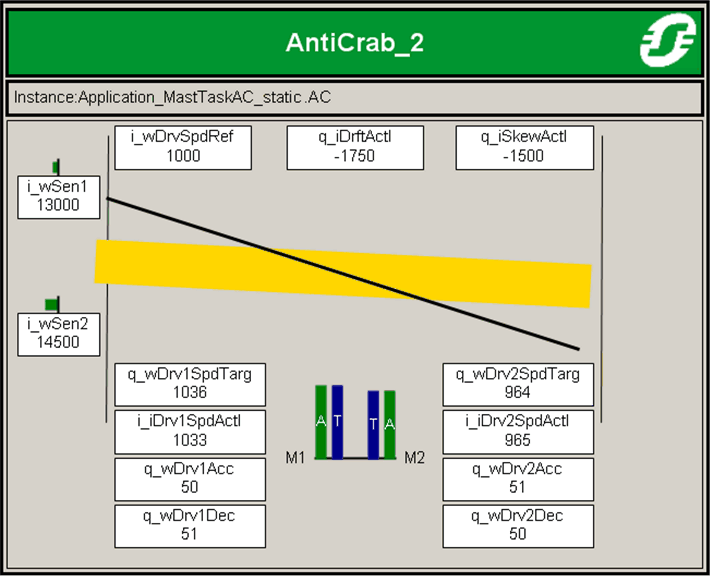

# Visualization

Visualization

Overview

The visualization is designed for assistance with commissioning of Anti-crab function.

It dynamically shows the following:

oactual position of the bridge in industrial cranes (yellow rectangle)

otarget position of the bridge in industrial cranes as a result of controller output (black line)

otarget speeds for motors 1 and 2 (blue rectangles with white T)

oactual speeds of motors 1 and 2 (green rectangles with white A)

oactual displacement of sensors 1 and 2 compensated with center positions i\_wSen1Centr and i\_wSen2Centr (horizontal green rectangles)

oactual values of sensor positions, skew, drift, target and actual speeds and ramp times

It is available inside the library and can be selected in the configuration of frame visualization object under SEAD\_HOIST.Visu\_AntiCrab\_2.

EIO0000003890.01

© 2020 Schneider Electric. All rights reserved.