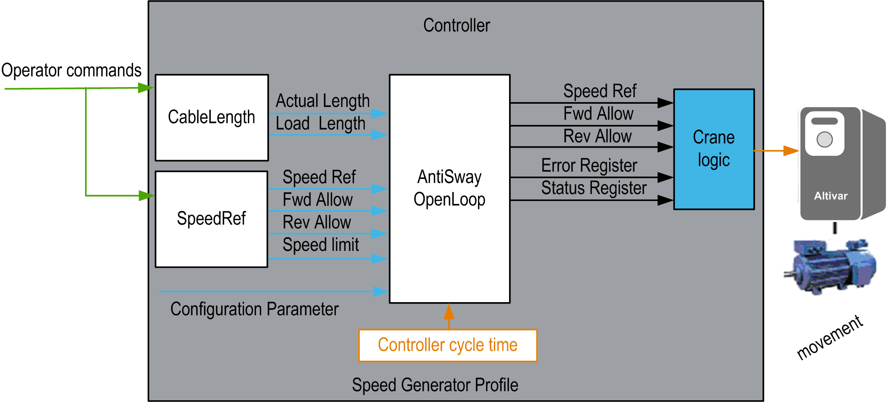

# Functional Overview

Functional Overview

Functional Overview

Functional Description

The Anti-sway function is designed for industrial cranes to correct the sway of the bridge or trolley movement.

NOTE: The Anti-sway solution is not compatible with the AntiCrab function block on the same axis.

The Anti-sway function is implemented and designed to be used to control Altivar drives.

The following table shows the 3 main features provided by the solution:

| Main Features | Description |
| --- | --- |
| Estimator | Load sway estimation is based on an adaptive model using setting parameters. (For example: Linear speed reference, acceleration, deceleration...) and the cable length. |
| Algorithm | Adaptive continuous algorithm provides Anti-sway correction to the operator command including dual axis Anti-sway operator assistance (For example: including simultaneous trolley, bridge crane and hoisting movements). |
| Working area control | Activation and suppression of the Anti-sway assistance. |

Why Use the Anti-Sway Function?

The main goal of this function is to assist the operator in correcting the load sway of the crane.

During trolley or translation movement, the load which is suspended tends to sway. The swaying may cause damage to the load or surrounding structures. The swaying can additionally increase the time required by the operator to keep the load in the correct position when setting it down. Only experienced operators are able to control the load properly.

|  |
| --- |
| Warning_Color.gifWARNING |
| UNCOMPENSATED WIND SPEED AND DIRECTION |
| Do not use the AntiSwayOpenLoop\_2 function block to control equipment that is in an outdoor environment, nor any environment subject to high velocity air movement sufficient to sway the load. |
| Failure to follow these instructions can result in death, serious injury, or equipment damage. |

This function block is intended to have significant influence on the physical movement of the crane and its load. The application of this function block requires accurate and correct input parameters in order to make its movement calculations valid and to avoid hazardous situations. If invalid or otherwise incorrect input information is provided by the application, the results may be undesirable.

|  |
| --- |
| Warning_Color.gifWARNING |
| UNINTENDED EQUIPMENT OPERATION |
| Validate all function block input values before and while the function block is enabled. |
| Failure to follow these instructions can result in death, serious injury, or equipment damage. |

Solution with the Anti-Sway Function

The following table shows the main advantages of this solution:

| Main Features | Description |
| --- | --- |
| Cost-effectiveness | Cost effective when compared to a conventional control system based on relays and conductors. |
| Easy to use | There are only a few parameter settings and no additional sensors. |
| Higher productivity | The function offers the possibility to run the crane up to +25% of normal crane operating speed which assists in providing [equipment](../glossary/glossary.htm#XREF_D_SE_0024697_690) protection. |
| Increase the machine life cycle | Less sway results in less mechanical shock and stress on the crane mechanism and structure. |

Functional View

EIO0000003890.01

© 2020 Schneider Electric. All rights reserved.