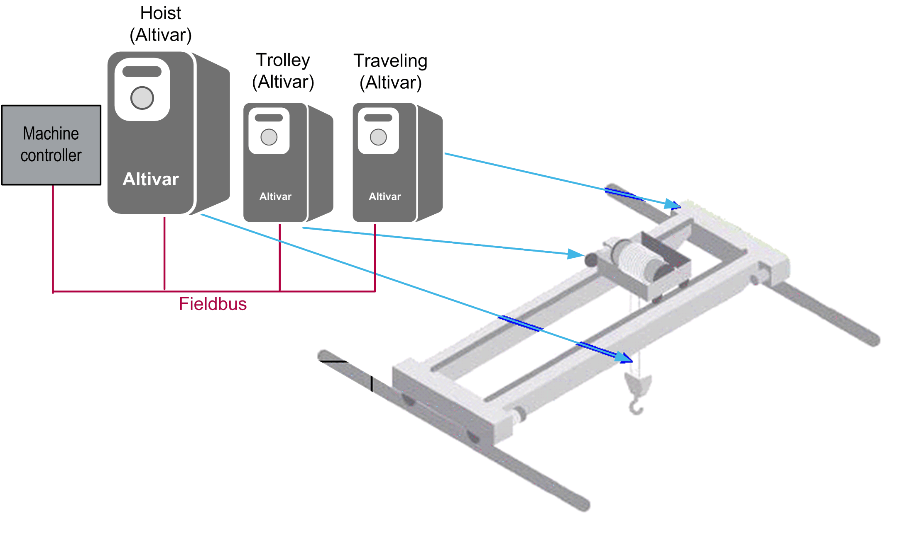

# Hardware Architecture

Hardware Architecture

Hardware Architecture Overview

The following figure displays the hardware architecture of the Anti-sway function with an EcoStruxure Machine Expert controller in an overhead traveling crane.

EIO0000003890.01

© 2020 Schneider Electric. All rights reserved.