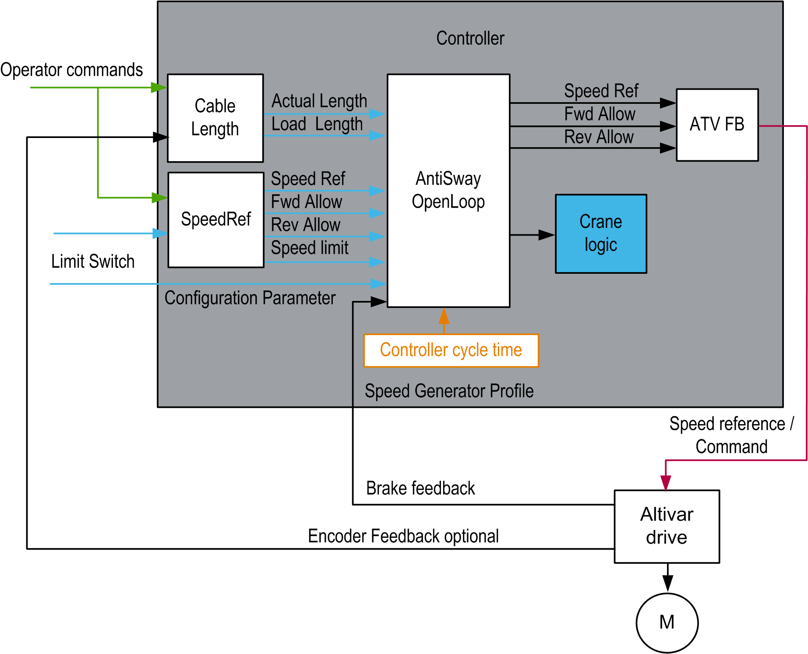

# Software Architecture

Software Architecture

Software Architecture Overview

The Anti-sway function consists of several individual function blocks fulfilling different sub-functions. These 3 main functions must be selected and configured:

oAnti-sway

oCable length

oSpeed reference

| AntiSway | Function Block | Description |
| --- | --- | --- |
| Anti-sway | AntiSwayOpenLoop\_2 | This function block provides the speed profile for the trolley or bridge movement, in order to correct the sway. |
| Cable length | CableLength\_2pos | This function block provides the cable length with 2 positions on a switch selector and an input for the load length. |
| CableLength\_3pos | This function block provides the cable length with 3 positions on a screw selector and an input for the load length. |
| CableLength\_Enc\_2 | This function block provides the cable length using an [encoder](../glossary/glossary.htm#XREF_D_SE_0024697_689) and an input for the load length. |

Data Flow Overview

EIO0000003890.01

© 2020 Schneider Electric. All rights reserved.