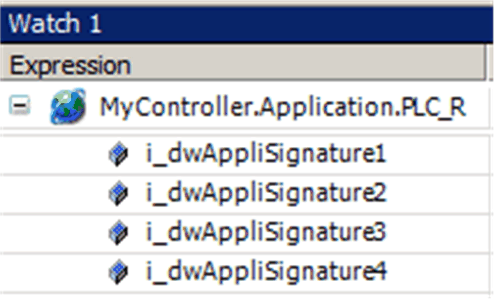
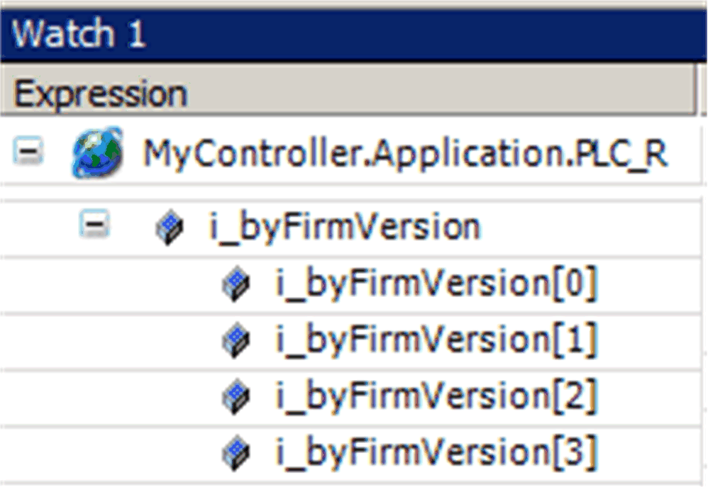
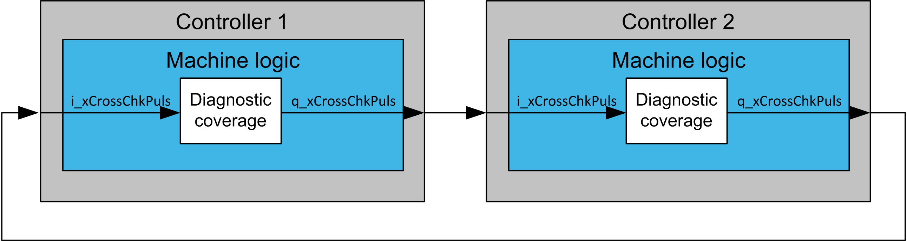

# Input Pin Description

Input Pin Description

Input Pin Description

| Input | Data Type | Description |
| --- | --- | --- |
| i\_xEn | BOOL | TRUE: Enables the function block.  FALSE: Disables the function block.  Refer to detailed description below. |
| i\_wExeCntCfg | WORD | Number of program executions  Range: 0...65535  Refer to detailed description below. |
| i\_dwAppliSignature1 | DWORD | Application signature 1  Range: 0...4294967295  Refer to detailed description below. |
| i\_dwAppliSignature2 | DWORD | Application signature 2  Range: 0...4294967295  Refer to detailed description below. |
| i\_dwAppliSignature3 | DWORD | Application signature 3  Range: 0...4294967295  Refer to detailed description below. |
| i\_dwAppliSignature4 | DWORD | Application signature 4  Range: 0...4294967295  Refer to detailed description below. |
| i\_bFirmVers0 | BYTE | Firmware version 0  Range: 0...255  Refer to detailed description below. |
| i\_bFirmVers1 | BYTE | Firmware version 1  Range: 0...255  Refer to detailed description below. |
| i\_bFirmVers2 | BYTE | Firmware version 2  Range: 0...255  Refer to detailed description below. |
| i\_bFirmVers3 | BYTE | Firmware version 3  Range: 0...255  Refer to detailed description below. |
| i\_wTaskTime | WORD | Task execution time.  Enter the value of task time in milliseconds corresponding to the value of the cyclic task in which the instance of Diagnostic coverage is executed (the master task).  Range: 0...65535  Scaling/Unit: ms |
| i\_wTaskJittLim | WORD | Limit of task execution jitter.  Range: 0...65535  Scaling/Unit: ms  Refer to detailed description below. |
| i\_xCrossChkEn | BOOL | Enables cross checking.  Refer to detailed description below. |
| i\_xCrossChkPuls | BOOL | Cross checking pulse input.  Refer to detailed description below. |
| i\_xTest | BOOL | Test state input.  Refer to detailed description below. |
| i\_xRst | BOOL | Resets status of the FB on rising edge and will reset the q\_xAppOK to TRUE if the conditions are fulfilled. |

i\_xEn

When TRUE, enables the FB. When FALSE, the FB enters a fallback state:

|  |  |
| --- | --- |
| q\_xEn | FALSE |
| q\_xAppOK | FALSE |
| q\_xCrossCheckPuls | FALSE |
| q\_wStat | 0 |

I\_wExeCntCfg

This input contains a value corresponding to the number of execution of all programs and sub-programs in the main cyclic task. The FB monitors the number of executions on the pin iq\_wExeCntActl. If the number of executions (increments of the value connected to iq\_wExeCntActl) is not equal to i\_wExeCntCfg, the q\_xAppOk output is set to FALSE.

i\_dwAppliSignature1...4

These inputs are used for testing of application signature. Each application has a unique application signature consisting of four 32 bit DWORD values. Connect retained DWORD variables to these inputs and after downloading the application, write values found in PLC\_R.i\_dwAppliSignature1..4 to these retained variables.

NOTE: Do not write hard-coded values to the application; each change of the application changes also its signature.

Location of application signature information

i\_bFirmVers0...3

These inputs are used for checking of controller firmware version. The firmware version consists of 4 byte values. The actual firmware version can be found in the PLC\_R structure in an array of BYTE.PLC\_R.i\_bFirmVers[0..3].

Location of controller firmware version information

i\_wTaskJittLim

This input contains the maximum allowed value of execution time jitter. If the cyclic task execution time exceeds the sum of i\_wTaskTime and i\_wTaskJittLim, q\_xAppOk output is set to FALSE. The protection only checks if the actual execution period is longer than configured, it will not react if the actual cycle time is shorter than configured.

i\_xCrossChkEn

TRUE on this input enables cross checking function for mutual checking of 2 controllers. The FB generates a pulse train with 400 ms period and 50% duty cycle at q\_xCrossChkPuls and expects a pulse train on the input i\_xCrossChkPuls. The output of the FB should be connected to a physical (solid state) output of the controller and the input of the FB to an input of the controller. Two controllers running an instance of the FB with mutually connected inputs and outputs are necessary for cross checking.

Connection of controllers for cross-checking

i\_xCrossChkPuls

Input for the pulse train coming from a second controller. The function is enabled when i\_xCrossChkEn is TRUE and gets activated after the first rising edge on this input. Activation of the function on the first rising edge prevents false alarms when one of the controllers involved in cross checking is switched on with a delay.

Before activation is the q\_xAppOk FALSE. Once activated the q\_xAppOk becomes TRUE and reverts to FALSE state only after 500 ms without incoming pulses.

i\_xTest

TRUE on this input bypasses checking of application signature, firmware version information, execution count, cycle time test and mutual cross checking of 2 controllers. Boolean operation test and floating point operation test remain active. It allows for a simple way of keeping the q\_xAppOk TRUE during commissioning period.

The input keeps its effect for 5 hours, if it stays TRUE for more than 5 hours, it is ignored.

EIO0000003890.01

© 2020 Schneider Electric. All rights reserved.