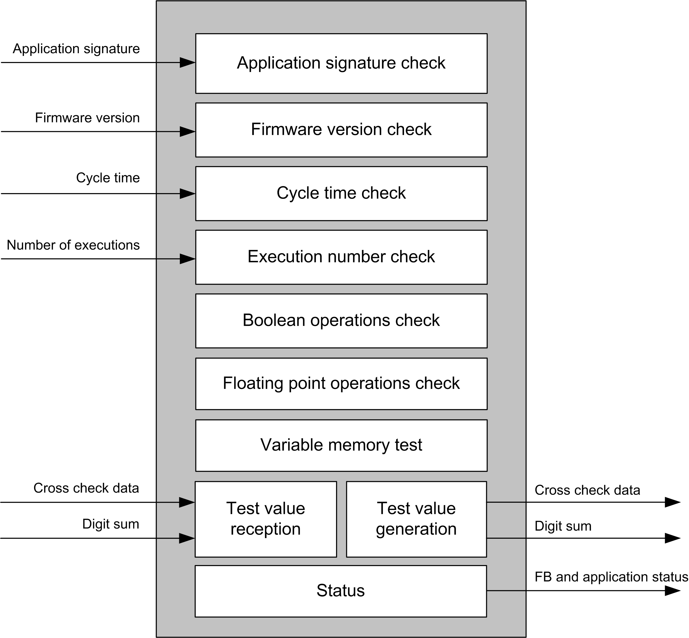
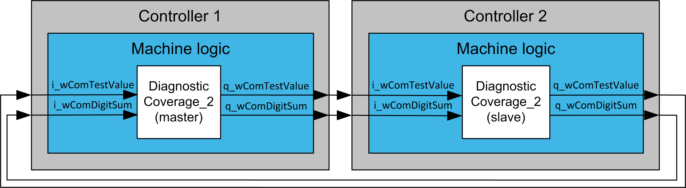

# Architecture

Architecture

Architecture

System Requirements

For any details of the system requirements, refer to the chapter [System Requirements](../System_Requirements/System_Requirements-1.htm#XREF_D_SE_0003458_1).

The function block supports cross checking with another instance of the function block running on a library-compatible controller, or by using an M221 Logic Controller with the cross checking logic implemented in EcoStruxure Machine Expert - Basic. For details refer to the user guide [Diagnostic Coverage for M221 - Application Guide](../front/front-4.htm#XREF_D_SE_0095059_9).

Data Flow

The following diagram depicts the checks performed by the function block. Cross checking between two controllers/function blocks is done using a test value generated by a pseudo-random number generator (Congruential generator) and digit sum of this number. Both numbers must be transferred at the same time to a diagnostic coverage function running in another controller. Any supported communication interface can be used to transfer data between the controllers.

Internal structure of the DiagnosticCoverage\_2 FB

Cross check between two controllers

EIO0000003890.01

© 2020 Schneider Electric. All rights reserved.