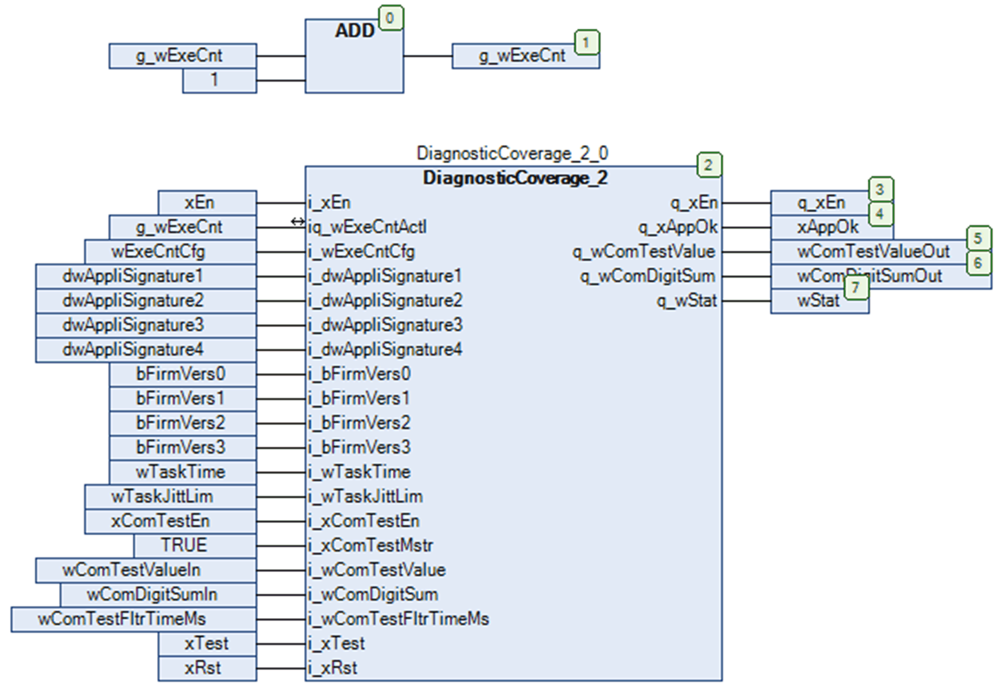

# Instantiation and Usage Example

Instantiation and Usage Example

Instantiation and Usage Example

This figure shows an instantiation example of the DiagnosticCoverage\_2 function block:

EIO0000003890.01

© 2020 Schneider Electric. All rights reserved.