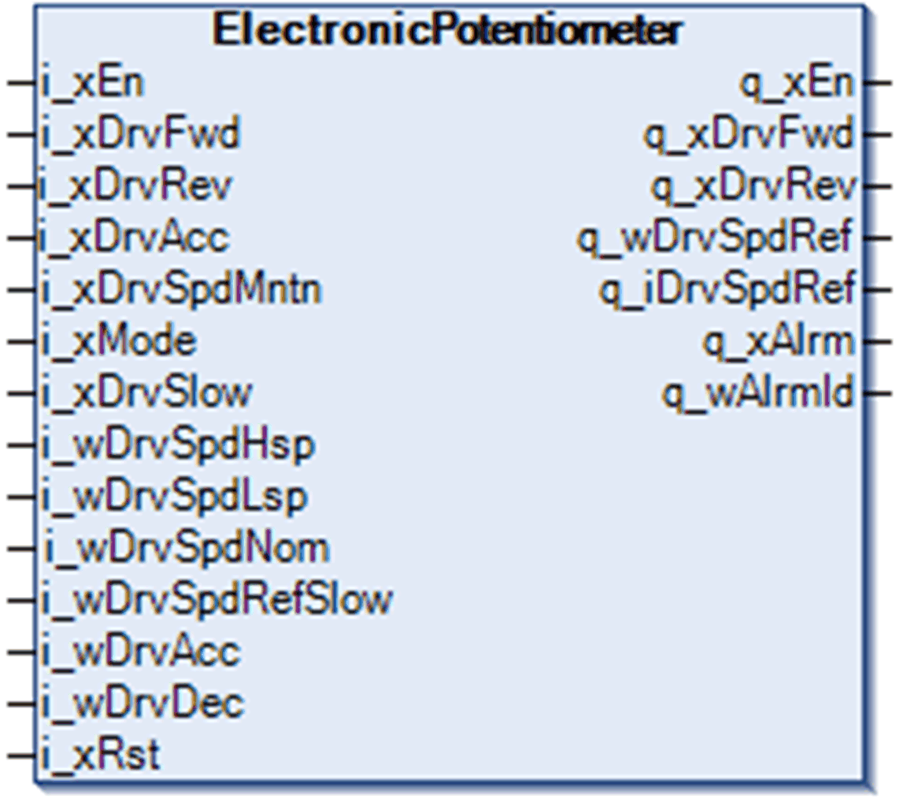

# Function Block Description

Function Block Description

ElectronicPotentiometer Function Block

Pin Diagram

Profile Generation

The FB generates an output speed profile based on configuration parameters and control inputs.

Direction command in either forward i\_xDrvFwd or reverse i\_xDrvRev direction causes the output speed reference to ramp to low speed i\_wDrvSpdLsp. Low speed can equal zero for drives running in full vector control. If the drive is not running in a full vector control, the value of i\_wDrvSpdLsp should be set to the same value as the LSP parameter inside the drive.

There are 2 modes of operation supported by the FB:

othree-wire control (uses 3 inputs i\_xDrvFwd, i\_xDrvRev and i\_xDrvAcc)

ofour-wire control (uses the 3 inputs plus i\_xDrvSpdMntn in addition)

In three-wire control mode

oi\_xMode is FALSE

oThe output speed reference increases when i\_xDrvAcc is TRUE and the direction command in actual direction is also TRUE.

oThe increase is limited by i\_wDrvSpdHsp, and if i\_xDrvSlow is TRUE, then it is limited by i\_wDrvSpdRefSlow.

oThe purpose of i\_xDrvSlow is to decrease the output speed reference independently of operator commands if a slow-down limit switch is activated.

oWhen the i\_xDrvAcc input returns to FALSE state but the active direction command stays TRUE, the actual value of output speed reference is held.

oWhen i\_wDrvSpdHsp changes during a profile generation and becomes lower than the output speed reference, the output speed reference is ramped down.

oIf the active direction command input is set to FALSE, the output speed reference gradually ramps down to zero speed using the ramp defined by i\_wDrvDec.

In four-wire control mode

oi\_xMode is TRUE

oThe output speed reference increases when i\_xDrvAcc, i\_xDrvSpdMntn and the direction command in actual direction are all TRUE.

oThe increase is limited by i\_wDrvSpdHsp, and if i\_xDrvSlow is TRUE, then it is limited by i\_wDrvSpdRefSlow.

oThe purpose of i\_xDrvSlow is to decrease the output speed reference independently of operator commands, if a slow-down limit switch is activated.

oWhen the i\_xDrvAcc input returns to FALSE state but the active direction and i\_xDrvSpdMntn command stay TRUE, the actual value of output speed reference is held.

oWhen i\_wDrvSpdHsp changes during a profile generation and becomes lower than the output speed reference, the output speed reference is ramped down.

oIf the active direction command input is set to FALSE, the output speed reference gradually ramps down to zero speed using the ramp defined by i\_wDrvDec.

oIf the i\_xDrvSpdMntn is set to FALSE, but the active direction is still TRUE, the output speed reference gradually ramps down to i\_wDrvSpdLsp using the ramp defined by i\_wDrvDec.

Both modes

There are 2 speed output reference outputs.

oThe unsigned q\_wDrvSpdRef is positive for both directions.

oThe signed q\_iDrvSpdRef is positive in forward and negative in reverse direction.

NOTE: Use the unsigned q\_wDrvSpdRef output when working with Altivar control device FBs.

Timing Diagram for Three-Wire Mode

Timing Diagram for Four-Wire Mode

EIO0000003890.01

© 2020 Schneider Electric. All rights reserved.