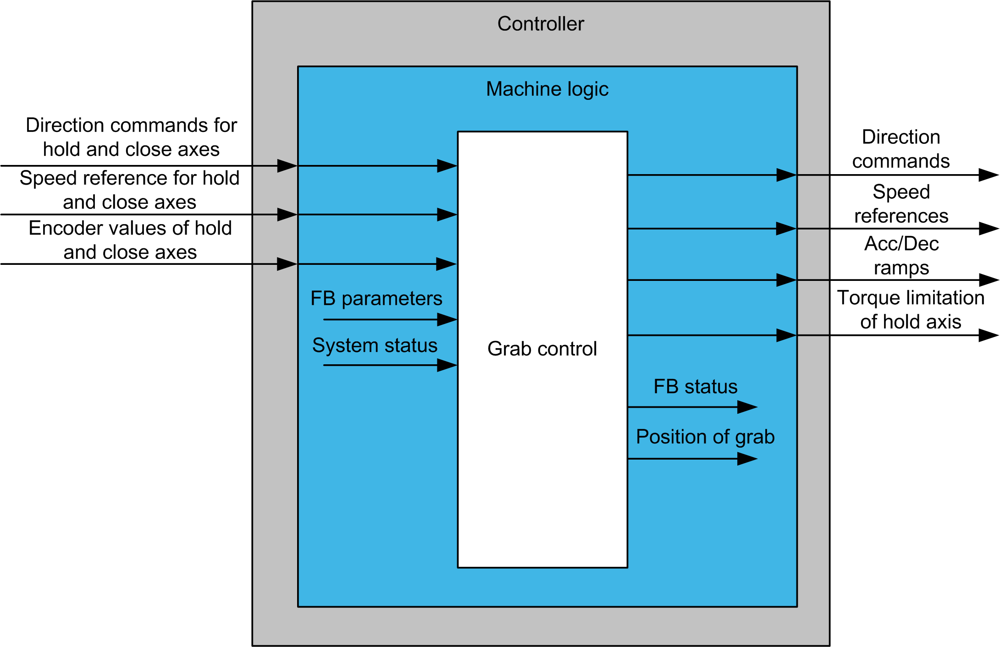

# Functional Overview

Functional Overview

Functional Overview

Why Use the GrabControl Function Block?

The function block helps to control hold and close axes of a four cable grab. It targets clamshell and spider grabs and contains an automatic function for [closing on stack](../glossary/glossary.htm#XREF_D_SE_0024697_780) which simplifies the operation.

This function block is intended to have significant influence on the physical movement of the crane and its load. The application of this function block requires accurate and correct input parameters in order to make its movement calculations valid and to avoid hazardous situations. If invalid or otherwise incorrect input information is provided by the application, the results may be undesirable.

|  |
| --- |
| Warning_Color.gifWARNING |
| UNINTENDED EQUIPMENT OPERATION |
| Validate all function block input values before and while the function block is enabled. |
| Failure to follow these instructions can result in death, serious injury, or equipment damage. |

Functional View

EIO0000003890.01

© 2020 Schneider Electric. All rights reserved.