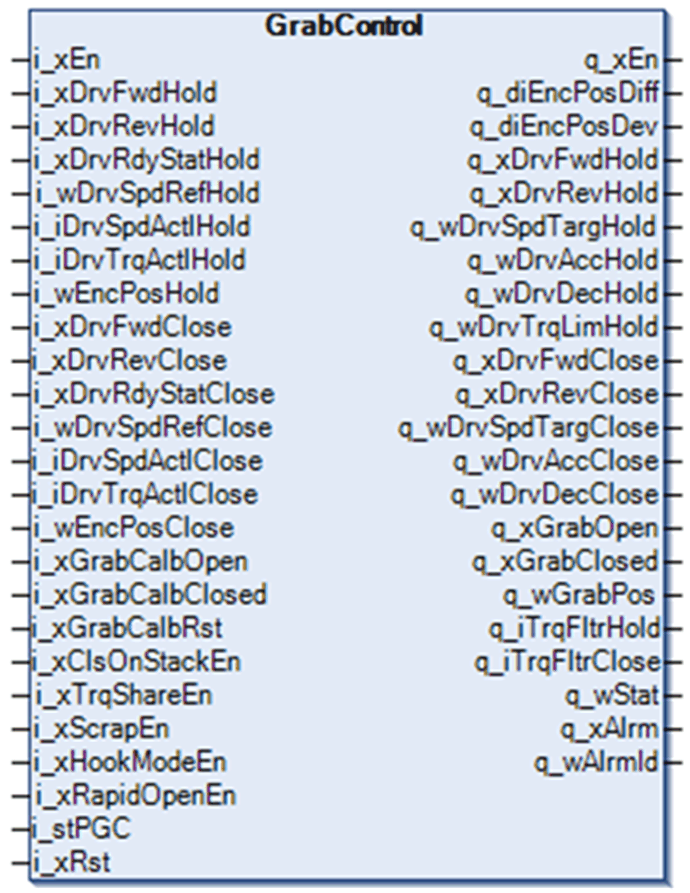
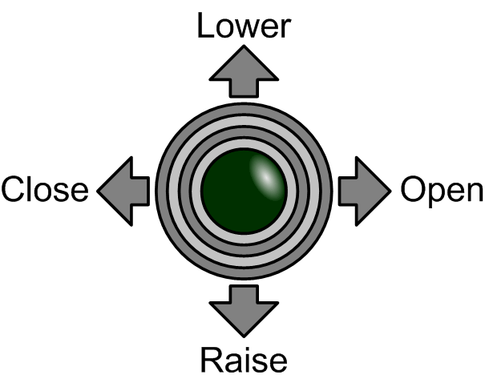
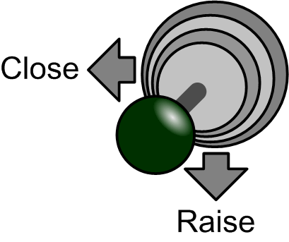

# Function Block Description

Function Block Description

GrabControl Function Block

Pin Diagram

The pin diagram of function block GrabControl:

Targeted Cranes

The function block is suitable for control of four cable grabs. It supports both clamshell and spider grabs and can be used on bridge cranes, gantry cranes, luffing jib cranes and floating grab cranes.

The schematic diagram of clamshell grab is as follows:

Control Interface

The function block is designed for use with a two-axis joystick. It requires one additional button on the joystick for optional functions of rapid opening and/or scraping.

Top-down view of a two-axis joystick :

Controls and command inputs for the function block:

| Controls | Command Inputs |
| --- | --- |
| Raise | i\_xDrvFwdHold |
| Lower | i\_xDrvRevHold |
| Close | i\_xDrvFwdClose |
| Open | i\_xDrvRevClose |

Alternative control interface may be used as long as the FB receives control commands in the supported form.

Grab Position Calibration

Position of a grab is calculated from relative difference of hold and close axes and values recorded during position calibration. Additional sensors for detecting open and closed state of the grab are not necessary.

The calibration values are used for the soft limit switch function which is limiting opening and closing of the grab.

Perform calibration by moving the grab successively to closed and open positions and setting the corresponding inputs to TRUE. Perform calibration on rising edge of the signal.

You can do the calibration of closed and open positions in an arbitrary order.

Calibration values are stored in a non-volatile memory of the controller.

Do not repeat calibration unless at least one of the axes moves while the controller and/or drives are switched off, while the communication between controller and drives is not working or when there is a problem with encoder signals.

Re-calibrate the position if the mechanics influencing relative positions of the axes changes, for example, cables are replaced.

Reset calibration values using the calibration reset input. Clalibrate again the closed and open positions after re-setting the calibration values.

Automatic Closing on Stack

This function automates the process of [closing on stack](../glossary/glossary.htm#XREF_D_SE_0024697_780). The purpose of this function is fast and soft closing of the grab followed by smooth transition to upwards movement of the closed and filled grab.

The following figure is the command to activate closing on stack:

It is activated by giving closing and raising commands simultaneously.

During closing, the close axis moves in forward direction closing the grab. The hold axis must provide enough torque to keep hold cables straight. It must also allow the grab to sink in the transported material in order to fill it properly. The amount of sinking can be influenced by configuration parameters.

The hold drive torque is limited during automatic [closing on stack](../glossary/glossary.htm#XREF_D_SE_0024697_780) which can lead to hold drive losing the load.

The hold motor is working in a torque limited mode during automatic [closing on stack](../glossary/glossary.htm#XREF_D_SE_0024697_780). If activation of the automatic closing on stack function must be suppressed while the grab is mid-air, the user application must take into account the enabling and disabling of the automatic closing on stack function. The situation often results in a detected over speed fault reported by the Altivar drive.

|  |
| --- |
| NOTICE |
| GRAB MECHANISM DAMAGE |
| Only use the automatic closing on stack function when the grab mechanism is in contact with the material to be moved. |
| Failure to follow these instructions can result in equipment damage. |

Torque Sharing and Position Synchronization

When the grab is moving upwards or downwards without closing or opening, the hold and closed axes are synchronized.

When the grab is not closed, the FB synchronizes position of both axes in order to keep their actual position difference.

When the grab is closed, the FB synchronizes either the position of both axes or sets target speed of both drives/motors in order to share the load between the two axes. The FB allows selection between these two modes. Torque sharing is preferred in most cases.

Scraping

Scraping is a special case of closing on stack usable with clamshell grabs. Its purpose is to gather remaining material from a flat surface. The grab closes while the jaws stay in contact with the surface.

When the grab is fully closed, the function starts upwards movement of the grab.

The command to activate scraping is as follows:

The function is optional and does not need to be configured and used if it is not needed.

An additional modifier button, preferably on the joystick, is needed. The same button may be also used for rapid opening function.

Rapid Opening

This function allows fast opening of the grab in order to release the load as quickly as possible. It is typically used when the grab is emptied while it is in a swing. The feature is usually used on pontoon cranes with a luffing jib.

The following figure is the command to activate rapid opening:

The function is optional and does not need to be configured and used if it is not needed.

An additional modifier button, preferably on the joystick, is needed. The same button can also be used for scraping function.

Hook Mode

Hook mode is an alternative to grab function. While in hook mode, the FB synchronizes the hold and close axes either based on actual relative positions of both axes or modifies speeds of both axes in order to share the load. The FB can be configured to do one or the other.

NOTE: Only the raise and lower commands are available in hook mode. Commands to close or open the grab are ignored.

Maintenance Mode

Use maintenance mode during changing of the cables and other maintenance tasks. Disabling the FB to activate the maintanence mode. In this mode the FB just channels the direction commands, speed references and ramp values through without changing them. Open and closed software limit switch positions are not active.

EIO0000003890.01

© 2020 Schneider Electric. All rights reserved.