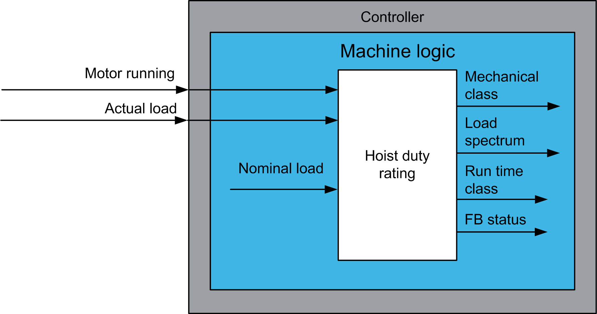

# Functional Overview

Functional Overview

Functional Overview

Why Use the HoistDutyRating Function Block?

The hoist duty rating function block collects run time data and calculates the actual mechanical class corresponding to the usage. This data can be used to identify whether the crane is being used according to its specification or is systematically overloaded.

Solution with the HoistDutyRating Function Block

The HoistDutyRating function block traces actual usage of a hoist.

Functional View

EIO0000003890.01

© 2020 Schneider Electric. All rights reserved.