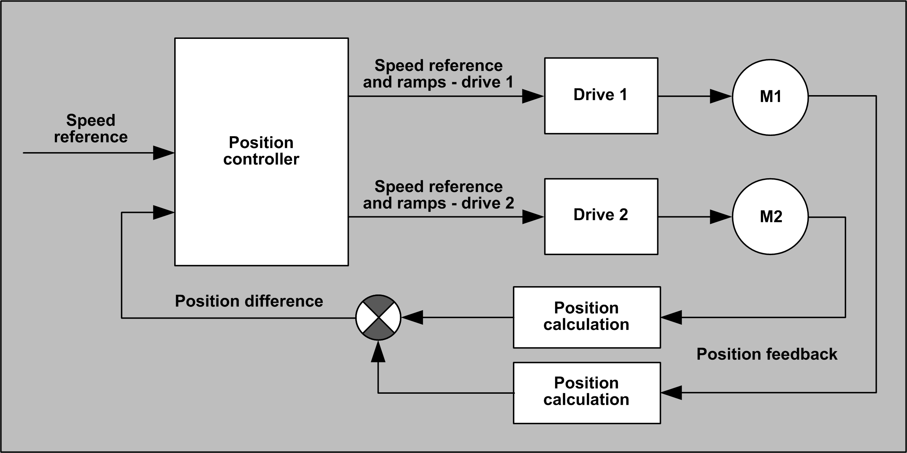

# Architecture

Architecture

Software Architecture

DataFlow Overview

The motors are equipped with encoders for the position feedback. The function block uses these encoder feedbacks in synchronous mode. The encoder position deviation is given to the proportional position controller. The controller corrects speeds, acceleration, and deceleration ramps of both motors to minimize the position deviation.

In non-synchronous mode, the user can operate the drives independently.

EIO0000003890.01

© 2020 Schneider Electric. All rights reserved.